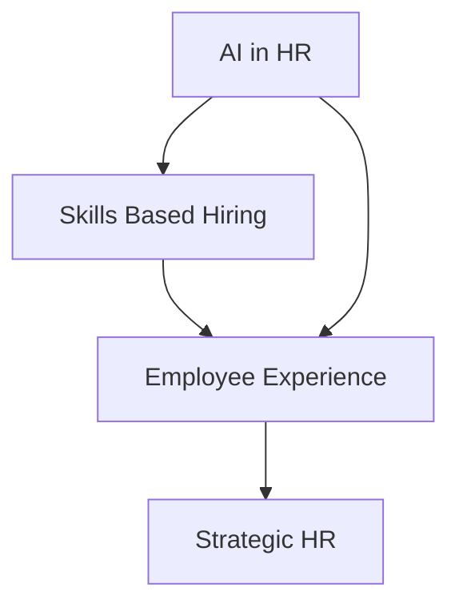

## HR in Late 2026: Navigating AI, Skills, and the Evolving Employee Experience

As we close out September 2026, the HR landscape is in a state of rapid transformation, driven by technological advancements and shifting workforce expectations. The days of HR as a purely administrative function are long gone; today, it stands as a critical strategic partner, actively shaping organizational resilience and competitiveness.

One of the most dominant forces is **AI-driven HR transformation**. Artificial intelligence is moving beyond pilot programs into everyday functions like recruiting, screening, and structured candidate selection. While it promises increased efficiency and data-driven decisions, HR leaders are also grappling with the implications of AI on roles, potential burnout, and the need for ethical implementation and robust data governance.

Closely linked to AI is the surge in **skills-based hiring and talent development**. Organizations are increasingly prioritizing skills over traditional job titles, leading to a focus on upskilling and reskilling initiatives to prepare employees for the human-machine era. This paradigm shift also fosters internal talent marketplaces and embraces flexible, fractional roles to meet evolving demands.

Finally, the **employee experience and holistic wellbeing** continue to be paramount. This goes beyond traditional benefits, integrating wellbeing as organizational infrastructure that influences work design, leadership, and team resilience. Continuous engagement, psychological safety, and addressing burnout are now board-level risks that directly impact productivity and performance. Successful HR strategies in 2026 are those that embed the desired culture into daily work, driving a tangible increase in employee performance.

The current environment demands HR leaders to be agile, data-driven, and capable of mobilizing change in an uncertain world.

