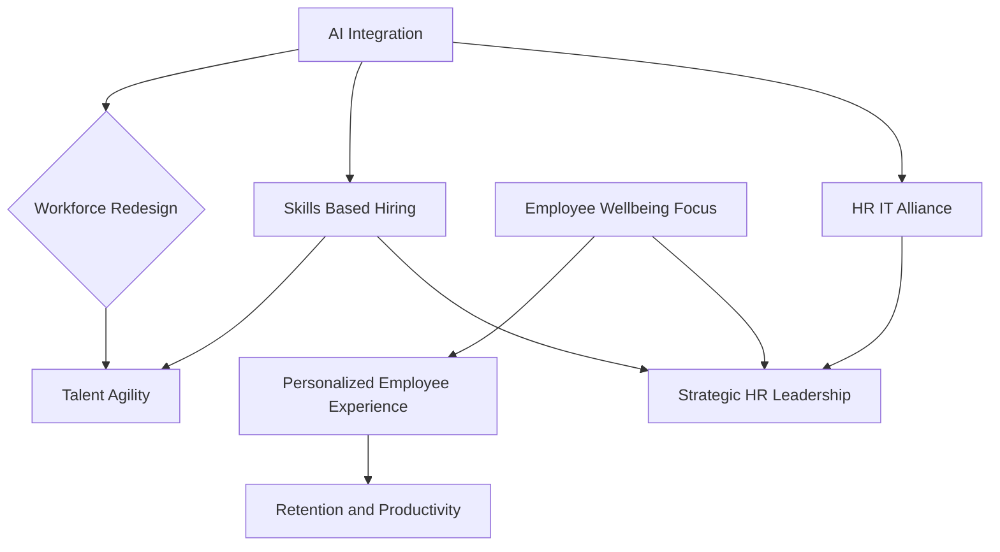

## Navigating 2026: The Pulse of HR Trends Right Now

As we move through late 2026, the Human Resources landscape is experiencing a profound transformation, moving beyond traditional administrative tasks to become a truly strategic powerhouse. The rapid evolution of technology, combined with a persistent focus on human-centric workplaces, defines the current HR agenda.

The most dominant force shaping HR today is Artificial Intelligence (AI). Organizations are rapidly adopting AI across various HR functions, with nearly half of all organizations expecting to utilize AI in HR this year. This isn't primarily about job elimination; rather, AI is 5.7 times more likely to shift job responsibilities and three times more likely to create new roles than to displace workers. The emergence of "agentic AI" — systems that can independently plan, act, and adapt to achieve multi-step goals — is reshaping HR technology and governance, demanding a balance between technological advancement and human-centered decision-making, trust, and compliance. HR leaders are now taking a pivotal role in guiding AI implementation, ensuring ethical use and effective integration with existing enterprise systems.

Alongside AI's pervasive influence, skills-based workforce strategies are gaining critical traction. The focus is shifting from rigid job titles to identifying and developing specific capabilities, enabling organizations to build agile workforces and respond flexibly to change. This approach connects business needs with employee development, making learning more purposeful. Complementing this, employee well-being, particularly mental health, remains a boardroom-level priority. Employers are responding to rising stress and burnout by offering personalized support, mental fitness days, enhanced employee assistance programs, and by normalizing mental health conversations within the workplace. The emphasis is on embedding well-being into the enterprise infrastructure and designing total rewards packages that are intentional and aligned with how people live and work.

This dynamic environment positions HR firmly as a strategic operator, requiring close collaboration with IT for successful digital transformation and AI integration. The goal for HR in 2026 is to leverage intelligent automation to streamline processes, gain deeper insights, and ultimately foster a high-performance culture through human-AI collaboration.

