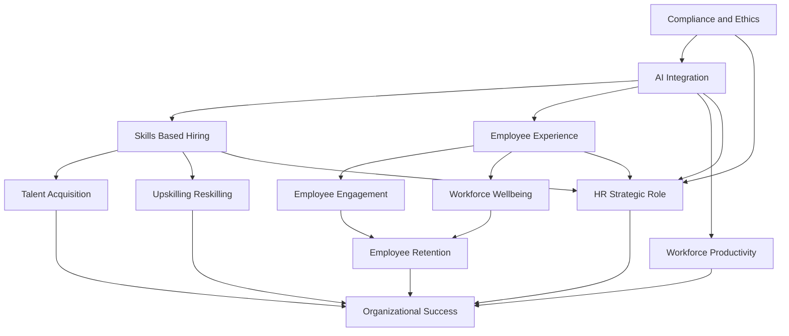

## HR's New Frontier: Navigating 2026's Pivotal Trends

As of late September 2026, the HR landscape is dynamically reshaping, driven by technological advancements, evolving workforce expectations, and a renewed focus on human-centric strategies. Far from being a back-office function, HR is firmly positioned as a strategic partner, critical to organizational resilience and competitiveness.

The most profound and actively discussed trend is the pervasive **integration of Artificial Intelligence (AI)** into virtually every facet of HR. AI is no longer a futuristic concept; it is operational, redefining roles, and enhancing productivity across recruitment, learning, and people analytics. Organizations are moving beyond experimentation, operationalizing AI to orchestrate routine tasks, free up human potential for higher-value work, and even power full HR workflows with "superagents". However, this rapid adoption comes with a crucial emphasis on **AI governance, bias auditing, and compliance** to ensure ethical implementation and build trust within the workforce.

Parallel to AI's rise, **skills-based hiring and workforce management** have become a dominant strategy. Employers are increasingly de-emphasizing traditional degree requirements, instead focusing on demonstrable skills, competencies, and real-world experience to fill critical gaps and expand talent pools. This shift is essential for adapting to the accelerated pace of technological change and addressing persistent labor shortages. Continuous upskilling and reskilling, often AI-powered, are now strategic imperatives to prepare employees for emerging roles and ensure workforce adaptability.

**Employee experience and holistic wellbeing** continue to be central to HR strategies. With global employee engagement remaining a challenge, organizations are investing in personalized experiences, comprehensive wellbeing programs, and mental health support to combat burnout and foster a sense of purpose. Flexible work arrangements are increasingly standard, and companies that prioritize employee satisfaction see significant returns in retention and productivity.

The convergence of these trends underscores HR's elevated **strategic role**. HR teams are forging stronger alliances with IT, leveraging data and AI to make better decisions, and actively shaping organizational culture to balance technological advancement with human judgment. This strategic repositioning moves HR from an administrative function to an architect of the future workforce.

