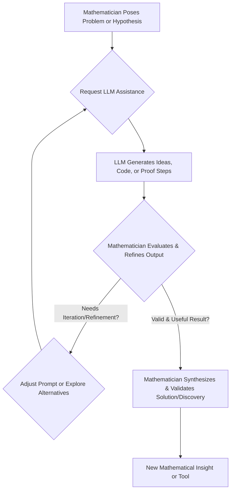

The Algorithmic Muse: How AI is Reshaping Mathematical Discovery
October 26, 2023

For centuries, mathematics has been viewed as a solitary pursuit, a testament to human intellect wrestling with abstract concepts. While the core of mathematical creativity remains uniquely human, recent advancements in Artificial Intelligence, particularly Large Language Models (LLMs), are beginning to redefine the landscape of mathematical discovery and problem-solving. This isn't about AI replacing mathematicians, but rather about a new era of powerful collaboration.

LLMs are no longer just advanced calculators; they are becoming sophisticated assistants capable of understanding and generating complex mathematical reasoning. They can assist in symbolic manipulation, generate code for numerical simulations, propose novel conjectures based on vast datasets of existing theorems, and even help structure steps for proving intricate theorems. Imagine an LLM suggesting an obscure theorem that perfectly fits a gap in your proof, or quickly translating a conceptual problem into a series of solvable computational steps. This capacity accelerates exploration, allowing mathematicians to test more hypotheses and explore more solution paths than ever before.

The profound implication is a shift in the mathematician's role. While foundational intuition and rigorous validation remain paramount, the burden of repetitive or computationally intensive tasks can be offloaded to AI. This frees up human intellect to focus on higher-level conceptualization, identifying novel research directions, and ensuring the ultimate mathematical rigor and interpretability of results. The synergy promises to unlock new frontiers, tackling problems previously deemed intractable due to their complexity or scale, heralding an exciting chapter where human ingenuity and algorithmic power converge.

Here's a high-level overview of how this collaborative workflow between mathematicians and LLMs might function:

