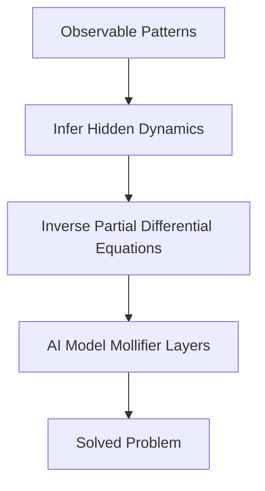

**The Evolving Landscape of Mathematics: AI, Complex Systems, and Emerging Frontiers**

May 03, 2026

This week in mathematics, we're witnessing a dynamic interplay between artificial intelligence and fundamental mathematical research, alongside significant strides in understanding complex systems and a concerning trend in global math education.

One of the most exciting developments is the increasing role of AI in mathematical research. Penn Engineers have developed a new AI-based method, termed "Mollifier Layers," capable of solving inverse partial differential equations (PDEs). These equations are crucial for understanding the natural world, allowing scientists to infer hidden dynamics from observable patterns. This breakthrough has implications for fields ranging from genetics to weather forecasting. This marks a significant step towards demystifying the "black box" of AI, with researchers developing a mathematical blueprint for transparent AI systems that can learn and remember, inspired by a "plastic vector field" concept.

The field of nonlinear dynamics and complex systems is also seeing notable advancements. Frank Merle was awarded the prestigious Breakthrough Prize in Mathematics for his work on nonlinear evolution equations, which describe phenomena like turbulence and plasma. His research sheds light on how these systems can remain stable or develop singularities, contributing to our understanding of complex phenomena relevant to aeronautics, fluid dynamics, and astrophysics. The Breakthrough Prize also recognized early-career mathematicians, including three Chinese women: Wang Hong and Tang Yunqing for the New Horizons in Mathematics Prize, and Zhang Mingjia for the Maryam Mirzakhani New Frontiers Prize.

However, a recent report highlights a troubling trend in global math education: a widening gender gap. Data from the Trends in International Mathematics and Science Study (TIMSS) indicates that boys are increasingly outperforming girls in mathematics, reversing years of progress in math equity.

Finally, the intersection of mathematics and quantum computing is gaining momentum. NVIDIA has launched the Ising family of open AI models, designed to accelerate the development of useful quantum computers by improving quantum error correction and calibration. This development leverages mathematical models to tackle complex challenges in quantum computing, underscoring the field's increasing reliance on advanced mathematical frameworks.

Here's a simplified look at how AI is being used to solve inverse problems:

