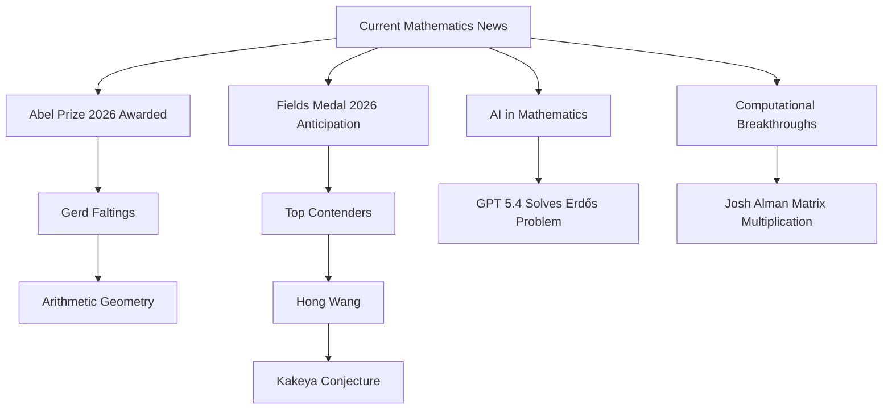

## Mathematics in Motion: Spring 2026 Highlights

The world of mathematics continues its relentless pursuit of discovery, with spring 2026 bringing significant accolades and intriguing new developments. From prestigious awards honoring foundational work to cutting-edge advancements powered by artificial intelligence, the field is buzzing with intellectual excitement.

### Abel Prize Celebrates Gerd Faltings' Groundbreaking Work

This year's Abel Prize, one of mathematics' highest honors, has been awarded to German mathematician Gerd Faltings. Announced in March, Faltings is recognized for "introducing powerful tools in arithmetic geometry and resolving long-standing Diophantine conjectures of Mordell and Lang." His groundbreaking proof of the Mordell conjecture in 1983, now known as Faltings' Theorem, was a major breakthrough that reshaped the field, uniting geometric and arithmetic perspectives. Faltings will officially receive the prize, which includes 7.5 million Norwegian Kroner, in Oslo on May 26, 2026.

### Fields Medal 2026: Anticipation Builds

With the International Congress of Mathematicians (ICM) set to take place in Philadelphia in July, anticipation is high for the announcement of the 2026 Fields Medals. These medals, awarded every four years to mathematicians under 40, recognize outstanding achievements. While no official announcement has been made, prediction markets and expert discussions point to several strong contenders. Hong Wang is widely considered a front-runner, with a high implied probability on various platforms as of early April 2026. Wang has already received the 2026 New Horizons in Mathematics Prize and a Clay Research Award for her significant work in harmonic analysis, particularly for contributions including the proof of the Kakeya conjecture in three dimensions. Other notable mathematicians frequently mentioned as potential recipients include Jacob Tsimerman, Jack Thorne, and Yu Deng.

### AI's Unexpected Role in Solving an Erdős Problem

In a surprising turn of events, a 23-year-old named Liam Price recently shared a solution to one of the notoriously difficult Erdős problems, a series of open conjectures by Hungarian mathematician Paul Erdős. What makes this particularly noteworthy is that Price, who holds no advanced math degree, reportedly achieved this breakthrough by simply prompting GPT-5.4 for an answer. Experts, including renowned mathematician Terence Tao, are positively evaluating the solution, highlighting the AI's "unexpected approach" in applying a known formula that human mathematicians had not considered for this specific problem. This development, which emerged in early May 2026, further underscores the burgeoning role of artificial intelligence in advancing mathematical discovery.

### Advancements in Computational Mathematics

Further demonstrating the intersection of mathematics and technology, Josh Alman was recently honored with The Franklin Institute's Benjamin Franklin NextGen Award on April 30, 2026. Alman's work has significantly advanced the speed and efficiency of matrix multiplication, a fundamental operation underpinning modern computing, artificial intelligence, and large-scale data processing. His breakthroughs have the potential to lead to faster algorithms, lower energy consumption, and more powerful technologies globally.

These recent developments highlight the vibrant and dynamic nature of mathematics, constantly pushing the boundaries of human (and artificial) understanding.

