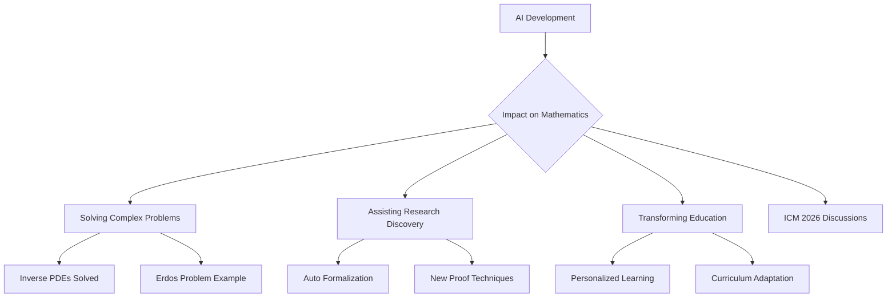

## AI Reshapes the Mathematical Landscape: A Look at May 2026 Developments

May 5, 2026 – The world of mathematics is abuzz with the increasing integration of Artificial Intelligence, signaling a transformative era for research, problem-solving, and education. Recent developments highlight AI's accelerating role, from tackling complex equations to shaping the agenda of major conferences.

One of the most immediate pieces of news comes from Penn Engineers, who, on May 1, 2026, unveiled a new AI method called "Mollifier Layers" designed to solve inverse partial differential equations (PDEs). This breakthrough is significant as inverse PDEs are notoriously challenging and have wide-ranging implications for fields such as genetics and weather forecasting. This innovative approach demonstrates AI's growing capacity to unlock previously intractable mathematical problems.

Further underscoring this trend, the upcoming International Congress of Mathematicians (ICM) in Philadelphia this summer (July 2026) will feature Artificial Intelligence as a top discussion point. Experts will delve into how AI is reshaping mathematical research and education, including discussions on auto-formalization and AI's potential to assist in mathematical discovery. Notably, a 23-year-old recently leveraged ChatGPT to solve an Erdős Problem that had remained unsolved for 60 years, doing so in just over 80 minutes. This rapid problem-solving capability showcases the practical, immediate impact of AI tools in advanced mathematics.

The influence of AI is clearly expanding beyond computational assistance, touching the very foundations of how mathematicians approach discovery and how future generations will learn.

