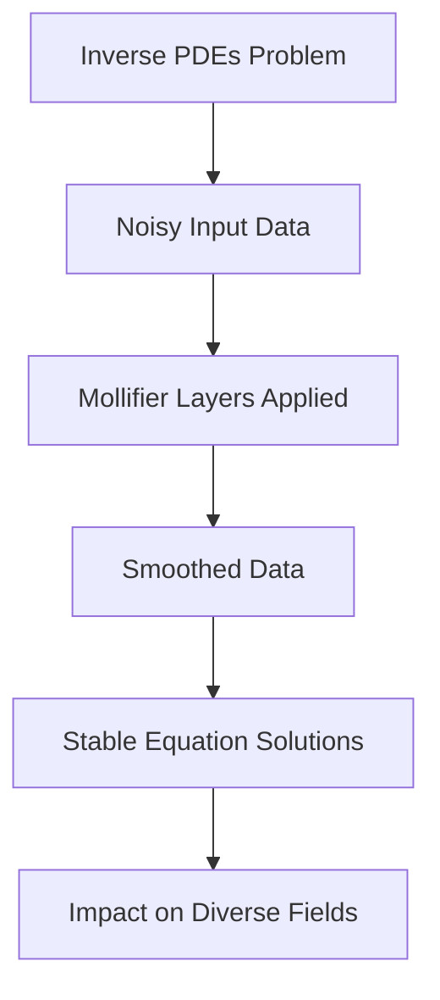

## Mathematics in Motion: AI Deciphers Equations, Faltings Honored

As of May 10, 2026, the world of mathematics continues to buzz with groundbreaking developments, showcasing both novel computational approaches and profound theoretical achievements. Recent days have brought exciting news, highlighting the dynamic frontiers of mathematical research.

One of the most immediate pieces of "live news" comes from the University of Pennsylvania, where researchers have unveiled a smarter AI method to tackle inverse partial differential equations (PDEs). Published on May 6, 2026, this new approach introduces "mollifier layers" to smooth noisy data, making these notoriously difficult calculations more stable and computationally efficient. Inverse PDEs are crucial for understanding complex systems, helping scientists work backward from observable effects to uncover hidden causes. This breakthrough could revolutionize fields from genetics, by decoding DNA behavior, to improving weather predictions.

Here's a simplified look at the new AI method:

Beyond computational advances, fundamental theory also saw major recognition earlier this year. The prestigious 2026 Abel Prize was awarded to German mathematician Gerd Faltings on March 19, 2026. Faltings, a professor emeritus at the Max Planck Institute for Mathematics, was honored for his "powerful tools in arithmetic geometry and resolving long-standing Diophantine conjectures of Mordell and Lang." His work has profoundly reshaped arithmetic geometry, uniting geometric and arithmetic perspectives and guiding decades of subsequent research. Faltings is set to receive the prize in Oslo on May 26, 2026.

These recent developments underscore the vibrant and ever-evolving nature of mathematics, demonstrating how both innovative algorithms and deep theoretical insights continue to push the boundaries of human knowledge.