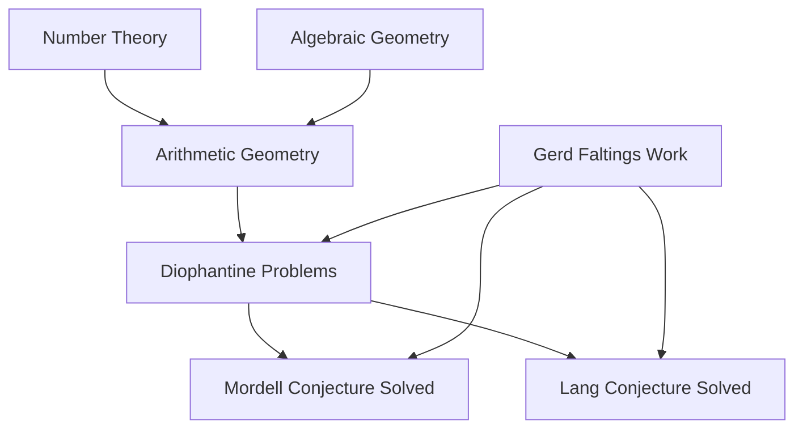

**Mathematics in Motion: Abel Prize Celebrates Arithmetic Geometry, New Discoveries Blossom**

May 14, 2026 – The world of mathematics is buzzing with fresh insights and prestigious accolades. This spring, Professor Gerd Faltings, director emeritus at the Max Planck Institute for Mathematics, was named the recipient of the 2026 Abel Prize, one of mathematics' highest honors. Announced on March 19, 2026, Faltings is recognized for his profound contributions to arithmetic geometry, a field that elegantly merges the study of numbers with abstract geometric forms. His groundbreaking work introduced powerful new tools and led to the resolution of long-standing Diophantine conjectures by Mordell and Lang, reshaping how mathematicians approach problems that had puzzled scholars for decades. The official award ceremony is scheduled for May 26, 2026, in Oslo.

Faltings' achievements exemplify the power of deep structural insight, uniting seemingly disparate areas of mathematics. His methods provided an important step towards proving Fermat's Last Theorem and remain a central pillar in modern Diophantine geometry.

In other breaking news today, scientists have uncovered a surprising mathematical secret within the leaves of the Chinese money plant. Researchers discovered a naturally occurring geometric pattern known as a Voronoi diagram, typically associated with city planning and computer science, in the plant's intricate leaf structures. This finding, published on May 14, 2026, reveals that the plant utilizes this elegant spatial logic to organize itself without conscious measurement, highlighting the hidden mathematical principles at play in nature.

