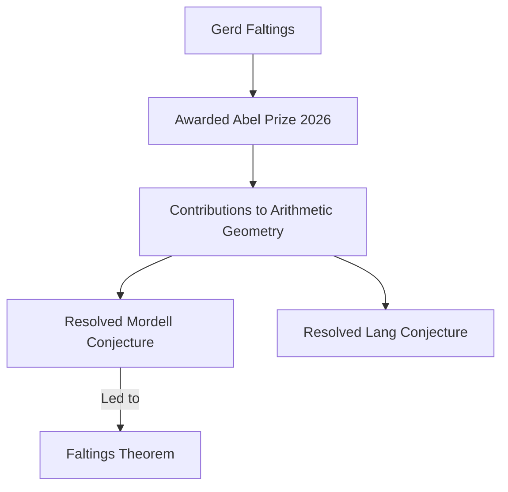

## Mathematics in the Spotlight: Gerd Faltings Wins 2026 Abel Prize

As of May 15, 2026, the mathematics world is celebrating a monumental achievement: German mathematician Gerd Faltings has been awarded the prestigious 2026 Abel Prize. Often considered the "Nobel Prize of mathematics," this accolade recognizes Faltings for his profound contributions to arithmetic geometry and his resolution of several long-standing Diophantine conjectures, including the Mordell and Lang conjectures.

Faltings' most famous result dates back to 1983, when he proved the Mordell conjecture, a problem that had stumped mathematicians for over six decades. This breakthrough, now known as Faltings' Theorem, demonstrated that certain complex equations have only a finite number of rational solutions. His work has fundamentally reshaped the field, uniting geometric and arithmetic perspectives and establishing new frameworks that continue to guide research today.

The Norwegian Academy of Science and Letters announced the award in March, citing Faltings as a "towering figure in arithmetic geometry." The official award ceremony is set to take place in Oslo on May 26, 2026.

Beyond this celebrated prize, the mathematical landscape continues to buzz with activity. Just this week, on May 14, 2026, researchers unveiled that Chinese money plant leaves exhibit naturally occurring Voronoi diagrams, a geometric pattern typically associated with computer science and city planning, showcasing nature's elegant mathematical organization. Also, on May 13, 2026, scientists solved the mystery of rotating Kaleidocycles, deriving explicit formulae for their construction. Furthermore, a groundbreaking paper on May 15, 2026, from NYU researchers suggests that string theory can emerge from "almost nothing" based on minimal assumptions about the universe.

These recent developments highlight the vibrant and ongoing exploration at the frontiers of mathematical discovery, from abstract theory to real-world applications and the hidden patterns in nature.

