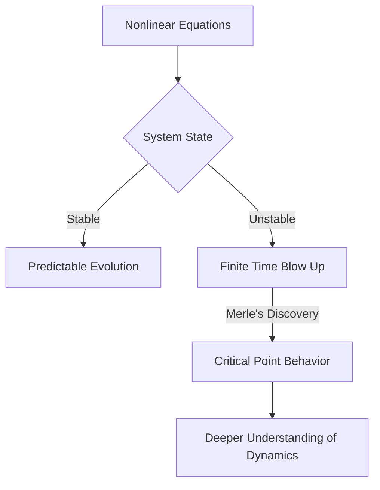

### Mathematics in Motion: Waves, Shapes, and Shattered Dogmas (May 16, 2026)

Mathematics, often perceived as an ancient and unchanging discipline, is a vibrant field constantly reshaped by groundbreaking discoveries. This week in May 2026, we're witnessing exciting developments that are pushing the boundaries of human knowledge, from the unpredictable dance of waves to the fundamental nature of geometric shapes.

**Understanding the Chaos of Waves: Frank Merle Honored**

Just last month, on April 18, 2026, the prestigious Breakthrough Prize in Mathematics was awarded to Frank Merle from CY Cergy Paris Université and Institut des Hautes Études Scientifiques. Merle was recognized for his transformative work on nonlinear evolution equations, which are mathematical descriptions of how dynamic systems like waves and fluids change over time. His research has provided significant advancements in understanding the stability, singularity, or resolution of these equations. A particularly surprising aspect of his discoveries is that equations long assumed to be stable can, in fact, "blow up" or become infinite in a finite amount of time, overturning fundamental assumptions in the field. This offers new insights into complex systems, from rogue waves to the behavior of plasma.

Here is a simplified view of the implications of Merle's work:

**A 150-Year-Old Geometric Rule Broken**

In another significant development announced on April 22, 2026, mathematicians have disproved a 150-year-old principle in geometry. Originating from the French mathematician Pierre Ossian Bonnet, this guiding idea suggested that if two key local properties (metric and mean curvature) of a compact surface were known, its exact global shape could be determined. However, researchers from the Technical University of Munich, Technical University of Berlin, and North Carolina State University have constructed two distinct doughnut-shaped surfaces, known as tori, that share identical local measurements for both metric and mean curvature but possess different overall structures. This breakthrough fundamentally alters our understanding of the relationship between local measurements and the global form of surfaces, opening new avenues in geometry.

These recent insights underscore that mathematics is far from static, continually revealing new complexities and elegant truths about the universe we inhabit.