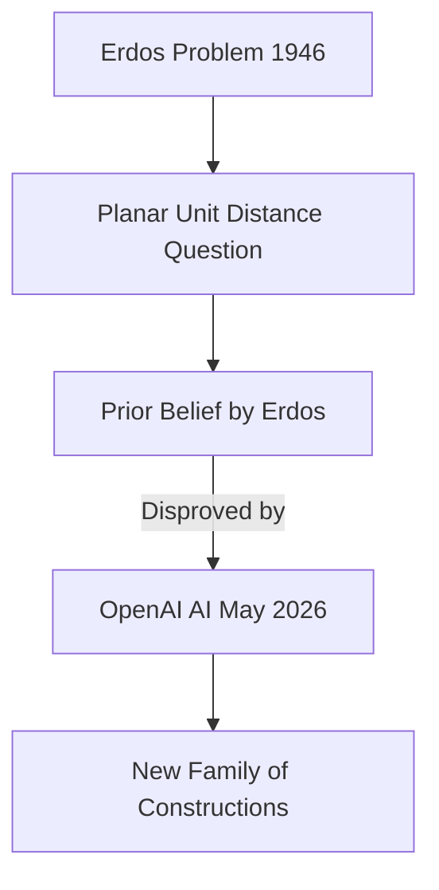

## AI Achieves Breakthrough on 80-Year-Old Erdős Problem

**May 21, 2026** – In a significant development for mathematics, OpenAI has announced that its artificial intelligence technology has successfully tackled a long-standing challenge posed by Hungarian mathematician Paul Erdős in 1946: the planar unit distance problem. This breakthrough, reported today, marks a further advance in AI's reasoning capabilities.

The planar unit distance problem asks how many pairs of points can be the same distance apart if you place a number of dots on a sheet of paper. Erdős had proposed that this number would only rise slightly faster than the number of dots themselves. However, an OpenAI model has now disproved this long-held belief, discovering an entirely new family of constructions that performs better.

While the broader problem remains unsolved, the AI's ability to demonstrate that Erdős's proposed limit was too low represents a crucial step forward. Mathematicians, including Thomas Bloom, who maintains the Erdős problems website, have validated the work, with Bloom co-authoring a companion paper to OpenAI's announcement. This achievement is being hailed as a "milestone in AI mathematics" by figures like mathematician Tim Gowers.

This event highlights the increasing role of AI in pushing the boundaries of mathematical discovery, allowing researchers to explore paths that human mathematicians might overlook.

