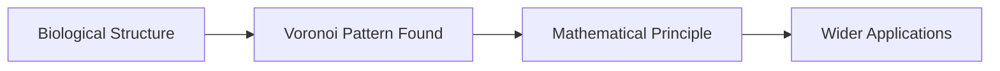

## Mathematics in Bloom: Uncovering Nature's Hidden Geometry and AI's Latest Contributions

As of May 22, 2026, the world of mathematics, while not always generating daily headlines like other news sectors, continues to unveil profound insights and breakthroughs that reshape our understanding of the universe. Recent developments highlight both the enduring quest to find mathematical structures in nature and the rapidly advancing role of artificial intelligence in discovery.

One fascinating recent discovery comes from the botanical world. On May 14, 2026, scientists announced they had uncovered a hidden mathematical secret within the leaves of the Chinese money plant (Pilea peperomioides): a naturally occurring Voronoi diagram. These geometric patterns, typically associated with fields like city planning, computer science, and network analysis, were observed to govern the arrangement within the plant's leaves. This surprising finding demonstrates how fundamental mathematical principles are often subtly woven into the fabric of the natural world, waiting to be discovered. Voronoi diagrams partition a plane into regions based on distances to a set of points, with each region containing all points closer to one specific "seed" point than to any other.

In parallel, artificial intelligence continues to make significant inroads into mathematical research. Just recently, on May 6, 2026, Penn researchers introduced a smarter AI method designed to tackle notoriously difficult inverse equations. These equations are crucial for scientists seeking to uncover hidden causes behind observable effects. By incorporating "mollifier layers" to smooth noisy data, this AI approach promises to accelerate discovery across various scientific disciplines. The growing interface between mathematics and AI is also being recognized through initiatives like the annual Prize in the Mathematics of Artificial Intelligence, awarded by the Association for Mathematical Research, with the 2025 prize recognizing work on understanding and improving AI.

These ongoing advancements underscore mathematics as a dynamic and ever-expanding field, constantly revealing new layers of complexity and beauty, whether through the intricate patterns of a plant or the sophisticated algorithms of AI.

