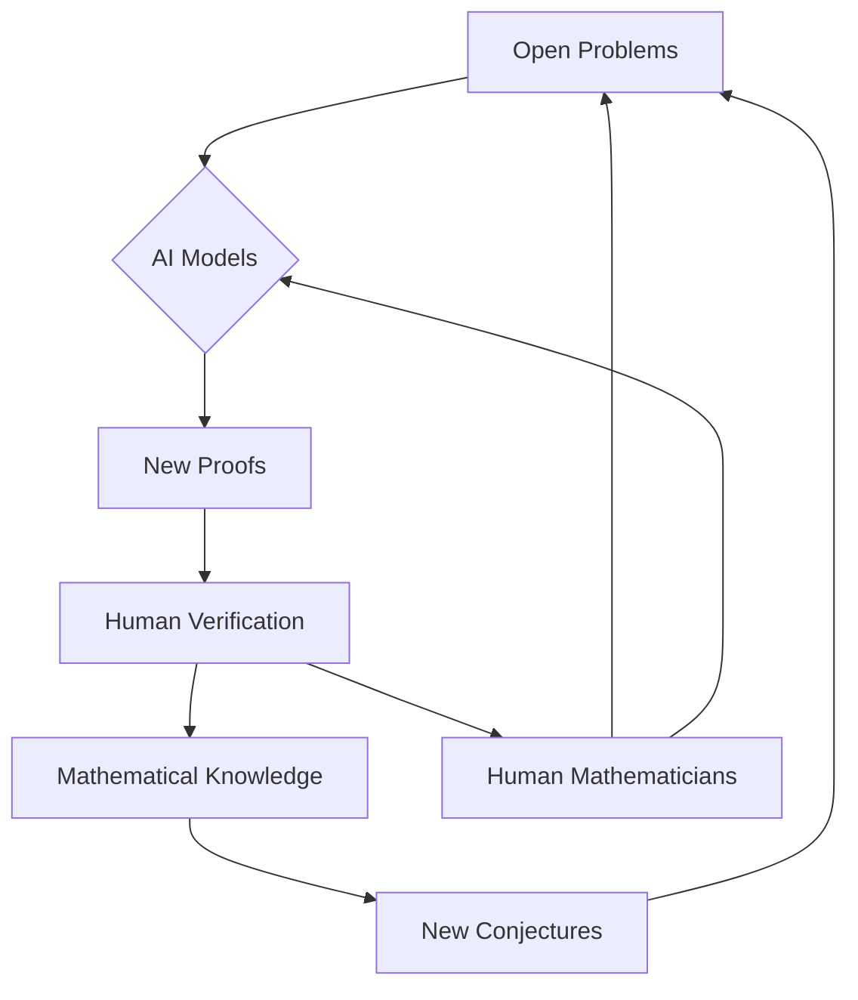

Mathematics continues to be a vibrant and rapidly evolving field, with May 2026 bringing forth a wave of exciting advancements. From groundbreaking AI-powered solutions to long-standing conjectures to the foundational reshaping of mathematical concepts, the frontier of discovery is expanding at an unprecedented pace.

One of the most compelling recent developments comes from the realm of artificial intelligence. OpenAI's general-purpose reasoning model has made significant progress on an 80-year-old challenge posed by Hungarian mathematician Paul Erdős: the planar unit distance problem. The AI model notably utilized algebraic number theory, a set of tools previously unexplored in this context, to achieve a polynomial improvement in constructing point patterns, effectively disproving an existing conjecture. This breakthrough underscores the increasing capability of AI in mathematical reasoning, with some experts, like Fields Medalist Tim Gowers, suggesting we are entering an era where human mathematicians may find it difficult to compete with AI in solving certain problems. The efficacy of AI-aided formal proof search is also evident, as another agent has autonomously resolved 9 of 353 open Erdős problems and 44 out of 492 OEIS conjectures. The intersection of AI and human ingenuity is further highlighted by the formal verification of Fields Medalist Maryna Viazovska's proofs in February 2026, a collaboration between mathematicians and Math, Inc.'s autoformalization model, Gauss.

Beyond AI, fundamental theoretical advancements continue to redefine our understanding. A monumental effort spanning 30 years culminated in the proof of the geometric Langlands conjecture over characteristic zero fields, a breakthrough described as a potential "grand unified theory of mathematics". For his profound contributions, Dennis Gaitsgory received the 2025 Breakthrough Prize in Mathematics. Similarly, the long-standing three-dimensional Kakeya conjecture was settled in early 2025, a deceptively simple problem foundational to harmonic analysis. Looking ahead, the United States is preparing to host the 2026 International Congress of Mathematicians (ICM) in Philadelphia from July 23-30, a global event that will feature presentations of the prestigious Fields Medals and further showcase the cutting edge of mathematical research.

