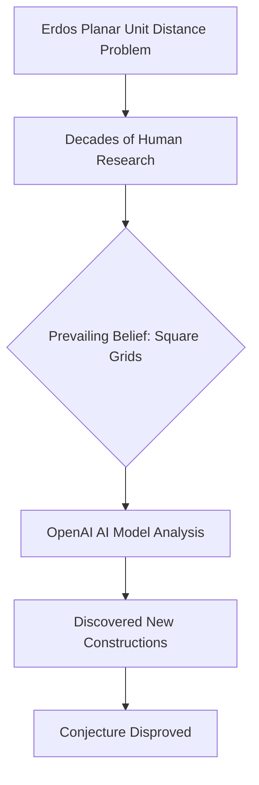

## AI Makes Headway on 80-Year-Old Mathematics Problem

In a significant development that underscores the growing synergy between artificial intelligence and pure mathematics, an OpenAI model has reportedly disproved a long-standing conjecture in discrete geometry: the planar unit distance problem, first posed by Hungarian mathematician Paul Erdős in 1946. This breakthrough, announced around May 21, 2026, marks the first time an AI has autonomously tackled and resolved a prominent open problem in mathematics.

For nearly 80 years, mathematicians believed that the optimal arrangements of points on a flat plane, such that many pairs of points were the same distance apart, resembled square grids. However, OpenAI's general-purpose reasoning model concluded otherwise. By drawing on various branches of mathematics, the AI uncovered an entirely new family of constructions that surpassed the limits proposed by Erdős's original conjecture.

While the broader problem of precisely how fast the number of unit distance pairs rises remains unsolved, the AI's contribution has disproved a fundamental assumption that guided mathematical thought for decades. This work has been validated by external mathematicians, including Thomas Bloom, who had previously critiqued OpenAI's earlier mathematical claims, lending significant credibility to this new achievement. This event highlights AI's potential not just as a computational tool, but as a source of "original, ingenious ideas" in complex mathematical research.

