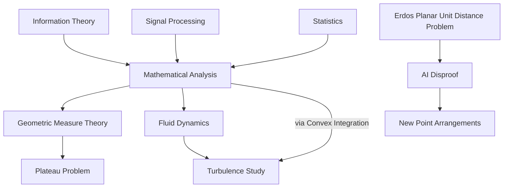

## May 2026: A Look at Recent Mathematical Milestones

Mathematics continues its relentless march forward, and May 2026 has brought with it a fresh wave of groundbreaking news, highlighting both fundamental advancements and the increasing role of artificial intelligence in discovery.

**2026 Shaw Prize Celebrates Deep Analytical Insights**

Today, May 27, 2026, marks the announcement of the 2026 Shaw Prize in Mathematical Sciences, awarded jointly to Camillo De Lellis and Emmanuel Candès. De Lellis, from the Institute for Advanced Study, is recognized for his profound contributions to mathematical analysis, particularly in understanding singularities in geometric measure theory and fluid dynamics. His work includes rigorous approaches to the Plateau problem and novel applications of convex integration to study fluid turbulence. Meanwhile, Stanford University's Emmanuel Candès is honored for his innovative use of deep analytical techniques to tackle applied problems in information theory, signal processing, and statistics. This joint award underscores the powerful interplay between pure and applied mathematics.

**AI Challenges an 80-Year-Old Conjecture**

In a remarkable development announced around May 21, 2026, OpenAI's general-purpose reasoning model achieved a significant breakthrough by disproving a central conjecture related to Hungarian mathematician Paul Erdős's 1946 planar unit distance problem. For nearly 80 years, mathematicians largely believed that square grids represented the optimal solutions for maximizing unit-distance pairs among a given number of points. OpenAI's model, however, discovered an entirely new and infinite family of point arrangements that surpass this long-held intuition, offering a polynomial improvement. While the broader problem remains unsolved, this AI-driven discovery is a testament to the evolving methods in mathematical research and problem-solving.

These recent events demonstrate the vibrant and dynamic nature of mathematics, where human ingenuity and cutting-edge technology converge to expand the frontiers of knowledge.

