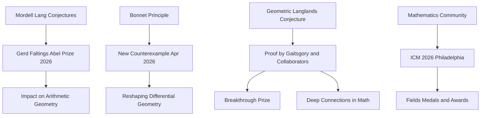

## Mathematics in Motion: May 2026 Highlights

As of May 28, 2026, the world of mathematics continues to pulsate with groundbreaking discoveries, prestigious accolades, and anticipation for major global gatherings. From resolving long-standing conjectures to challenging foundational principles, mathematicians are pushing the boundaries of knowledge.

One of the most significant recent announcements is the **Abel Prize 2026**, awarded to **Gerd Faltings** for his introduction of powerful tools in arithmetic geometry. His work has been instrumental in resolving major, long-standing Diophantine conjectures, including those of Mordell and Lang. This recognition, announced on March 19, 2026, highlights profound achievements in understanding polynomial equations over rational numbers.

In a surprising development in geometry, a **150-year-old rule** has been disproven. On April 22, 2026, mathematicians revealed they found two distinct doughnut-shaped surfaces, known as tori, which appear identical when measured locally but possess fundamentally different overall global forms. This breakthrough reshapes our understanding of the relationship between local measurements and global shapes in differential geometry, challenging a principle originating from Pierre Ossian Bonnet.

Adding to the list of monumental achievements from late 2025, the **Geometric Langlands Conjecture** has seen a major part of its proof completed by Dennis Gaitsgory and his collaborators, a monumental effort spanning 30 years and resulting in nearly 1,000 pages of published work. Heralded as a potential "grand unified theory of mathematics," this profound vision also saw Dennis Gaitsgory honored with a 2025 Breakthrough Prize in Mathematics for his foundational contributions.

Looking ahead, the mathematical community is abuzz with preparations for the **International Congress of Mathematicians (ICM) 2026**, scheduled to take place in Philadelphia, USA, from July 23-30, 2026. This premier event will feature distinguished speakers and is where the prestigious Fields Medals and other significant honors will be presented, celebrating mathematical excellence globally. Additionally, 2026 has been declared the "Year of Math" in the U.S., a national campaign aimed at fostering a deeper appreciation for mathematics among a broad audience.

Here's a snapshot of these dynamic interactions:

These recent developments and upcoming events underscore the vibrant and ever-evolving landscape of mathematics, reminding us that this fundamental science continues to inspire and innovate.