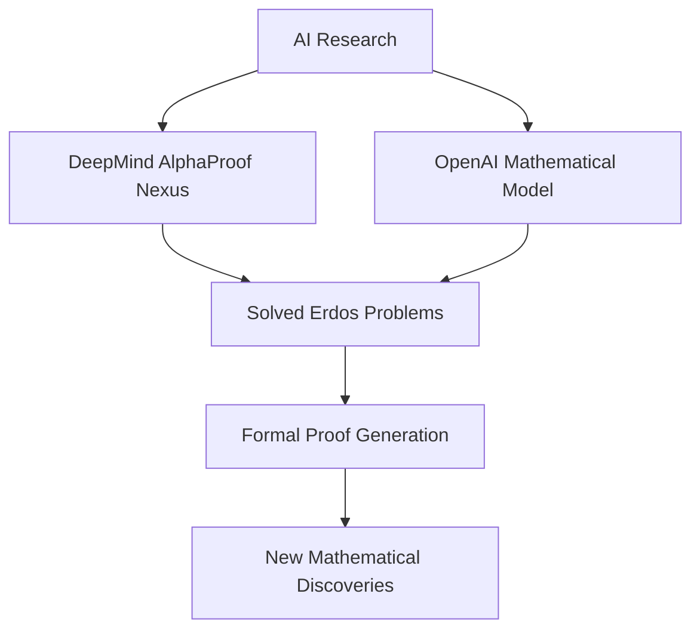

## Mathematics in Motion: AI Breakthroughs, Cosmic Rethinks, and Prestigious Honors Mark a Dynamic May 2026

As May 2026 draws to a close, the world of mathematics is buzzing with significant developments, ranging from artificial intelligence making unprecedented inroads into solving long-standing problems to a bold challenge to our understanding of the universe's expansion.

One of the most compelling narratives emerging this month is the remarkable progress in **Artificial Intelligence tackling complex mathematical conjectures**. On May 21, 2026, both Google DeepMind's AlphaProof Nexus and an OpenAI model announced significant achievements. AlphaProof Nexus formally resolved nine open problems from Paul Erdős's legendary research list, some of which had remained unsolved for over half a century. This system, combining Google's Gemini 3.1 Pro language model with the Lean formal proof assistant, generates machine-verified proofs, marking a critical step beyond plausible-looking but potentially flawed AI-generated arguments. Simultaneously, OpenAI announced its own breakthrough, successfully tackling the 80-year-old planar unit distance problem posed by Paul Erdős, disproving a long-held belief with new constructions. These advances underscore the growing capability of AI not just to assist, but to actively contribute to fundamental mathematical discovery by exploring paths human mathematicians might overlook.

Adding to the vibrant landscape, the prestigious **Abel Prize for 2026** was awarded to German mathematician Gerd Faltings. Announced in March, the ceremony took place on May 26, 2026. Faltings received the honor "for introducing powerful tools in arithmetic geometry and resolving long-standing Diophantine conjectures of Mordell and Lang." His work, including the celebrated Faltings' Theorem (originally proving the Mordell conjecture in 1983), has been hailed for uniting geometric and arithmetic perspectives and reshaping the field of arithmetic geometry.

Meanwhile, in a development that could reshape cosmology, mathematicians from the University of California, Davis, presented a **mathematical challenge to the standard model of cosmic expansion**. In a paper published on May 28, 2026, in *Proceedings of the Royal Society A*, they provided mathematical proof that instabilities inherent in the Einstein-Euler equations imply the Lambda-cold dark matter model, which posits dark energy as the driver of accelerated expansion, may not be viable. This research suggests that the accelerating expansion of the universe might be a direct consequence of Einstein's original theory, offering a simpler explanation without invoking dark energy.

These diverse developments highlight a truly exciting period for mathematics, where new technologies are augmenting human ingenuity and foundational theories are being rigorously re-examined.

