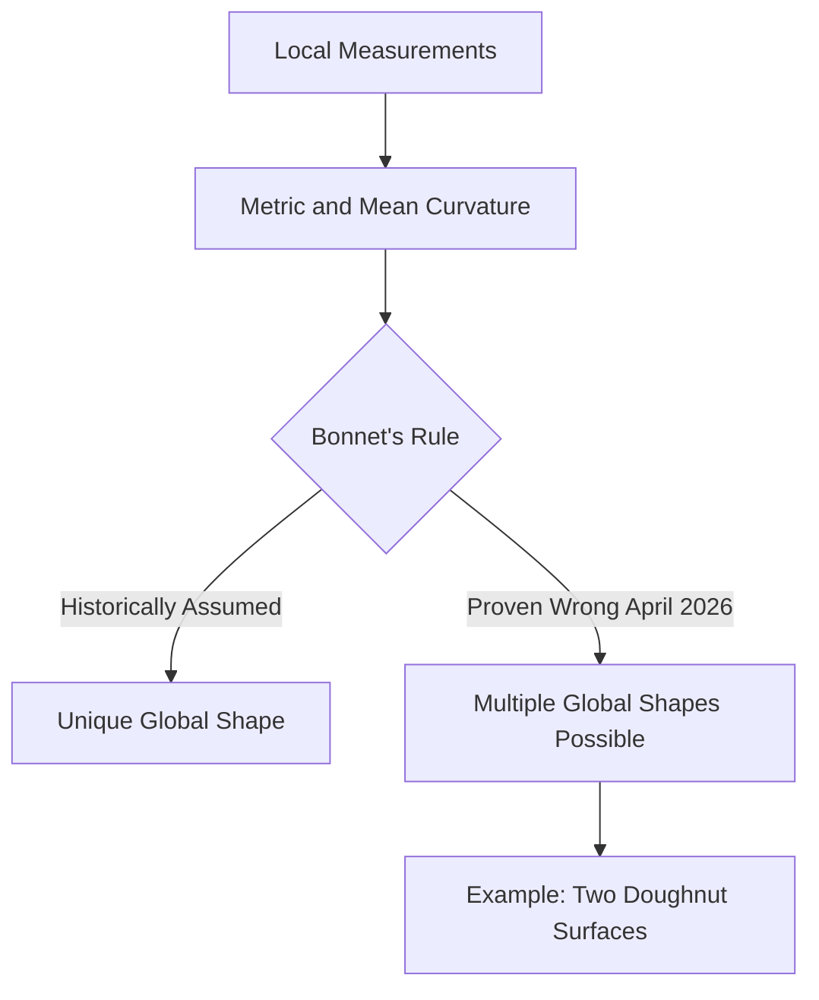

## Geometry's 150-Year-Old Rule Just Got a Doughnut-Shaped Update

Mathematics is often perceived as a realm of immutable truths, but even its bedrock principles can be challenged by new discoveries. In a remarkable development reported in April 2026, mathematicians have broken a 150-year-old geometric rule, reshaping our understanding of how local measurements relate to a global form.

For over a century and a half, a guiding principle in geometry, originating with French mathematician Pierre Ossian Bonnet, held that if you knew two key properties of a compact surface at every point—its metric (distances along the surface) and its mean curvature (how it bends in space)—you could determine its exact, unique overall shape. This rule suggested that local information was sufficient to reconstruct the global form.

However, researchers from the Technical University of Munich, the Technical University of Berlin, and North Carolina State University have now found a concrete counterexample. They constructed two distinct compact, doughnut-shaped surfaces, known as tori, that possess identical metric and mean curvature values at every point. Despite sharing these precise local characteristics, their overall global structures are demonstrably different.

This breakthrough disproves the long-held assumption of a unique global shape based solely on local measurements for certain types of surfaces. It signifies a profound shift in how mathematicians understand the intricate relationship between infinitesimal properties and the macroscopic form of geometric objects, opening new avenues for research in differential geometry.

