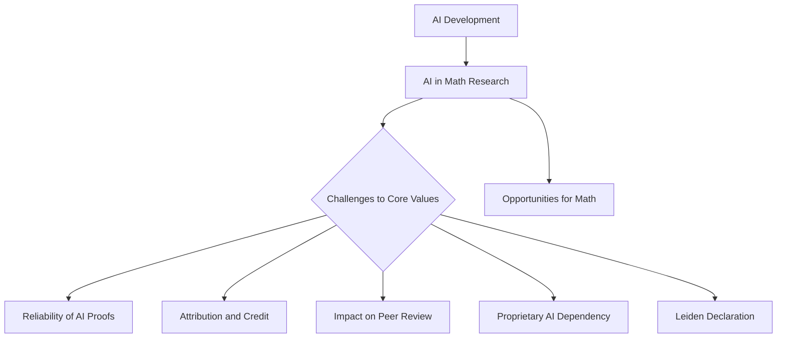

## Mathematics Community Grapples with AI's Impact; Calls for Ethical Guidelines

**June 02, 2026** – The mathematical community is abuzz with the release of the "Leiden Declaration on Artificial Intelligence and Mathematics" today, June 2, 2026. This significant statement, developed by a group of international researchers, addresses the profound challenges and opportunities presented by the increasing integration of AI into mathematical research. The declaration, which has garnered over 130 signatories, outlines critical concerns regarding the reliability of AI-generated proofs, proper attribution, the impact on peer review, and the potential for dependence on proprietary AI models.

Mathematicians emphasize that while AI offers exciting new avenues for discovery, it also compels a reevaluation of the discipline's fundamental values. The declaration seeks to establish clear community norms and ethical considerations to ensure that AI serves to benefit, rather than undermine, the rigorous and human-centric nature of mathematics. The International Mathematical Union (IMU) has officially endorsed the declaration, affirming that the future of mathematical research must remain guided by human judgment, transparency, and shared communal values.

In other recent news, the prestigious 2026 Abel Prize was awarded to Professor Gerd Faltings of the Max Planck Institute for Mathematics in Bonn, Germany. Announced on March 19, 2026, Faltings was recognized for his groundbreaking contributions to arithmetic geometry, particularly for introducing powerful tools and resolving long-standing Diophantine conjectures by Mordell and Lang. The award ceremony took place on May 26, 2026, in Oslo.

The discussions surrounding AI's role and the recognition of foundational work like Faltings' highlight a dynamic period for mathematics, balancing innovation with the preservation of its core principles.

