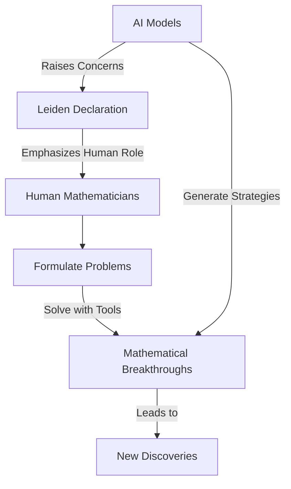

## Mathematics in Motion: A Look at June 2026's Top Stories

Mathematics, often perceived as an ancient and unchanging discipline, is a vibrant field constantly pushing the boundaries of human knowledge. As of June 3, 2026, the mathematical world is abuzz with groundbreaking awards, significant algorithmic advancements, and crucial discussions about the future of the discipline.

### Gerd Faltings Awarded the 2026 Abel Prize

One of the most prestigious accolades in mathematics, the Abel Prize, was awarded to German mathematician Gerd Faltings in March 2026. Faltings, director emeritus at the Max Planck Institute for Mathematics in Bonn, was honored for his profound contributions to arithmetic geometry, particularly for introducing powerful tools and resolving long-standing Diophantine conjectures such as those by Mordell and Lang. The Norwegian Academy of Science and Letters recognized him as "a towering figure in arithmetic geometry" whose ideas have reshaped the field. The official award ceremony took place on May 26, 2026, in Oslo.

### AI Challenges Long-Held Mathematical Beliefs

In a remarkable development announced by OpenAI in May and June 2026, artificial intelligence models have made significant strides in solving complex mathematical problems. Most notably, an AI model identified a new strategy to tackle the planar unit distance problem, one of Paul Erdős's famously stubborn questions posed in 1946. The AI's approach disproved a central conjecture, which for nearly 80 years suggested that grid-like arrangements were optimal for maximizing pairs of points at a unit distance. This breakthrough, described by some mathematicians as the "unique, interesting result produced autonomously by A.I. so far," has sparked widespread discussion about the evolving role of AI in mathematical discovery.

### The Leiden Declaration: Safeguarding Human Mathematics

Amidst the excitement surrounding AI's capabilities, a significant counter-movement emerged on June 3, 2026. Dozens of mathematicians worldwide signed the "Leiden Declaration," a powerful statement calling for the discipline to resist the hype around artificial intelligence and emphasizing that mathematics should remain a profoundly human endeavor. The declaration warns governments against uncritically believing claims about AI's mathematical abilities and urges regulation of the AI industry to prevent power concentration in private hands. This initiative, officially supported by the International Mathematical Union (IMU), highlights growing concerns about the fundamental values and future direction of mathematical research in an age of rapid technological advancement.

These unfolding stories underscore a fascinating period in mathematics, blending human ingenuity with the challenges and opportunities presented by emerging technologies.

