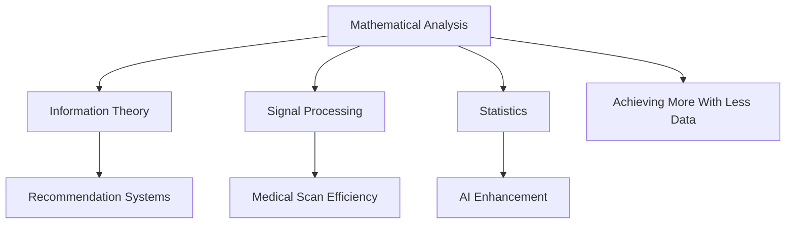

## Mathematics in the News: 2026 Shaw Prize Recognizes Impactful Analysis

Today, June 4, 2026, the mathematics world celebrates a significant announcement: Emmanuel Candès of Stanford University, along with Camillo De Lellis of the Institute for Advanced Study, has been awarded the prestigious 2026 Shaw Prize in Mathematical Sciences. Often dubbed the "Nobel of the East," the Hong Kong-based Shaw Prize Foundation recognized Candès for his profound work in mathematical analysis and its rigorous application to problems in information theory, signal processing, and statistics.

Candès's research stands out for its ability to extract complex, high-resolution results from sparse data, a methodology that has revolutionized information processing and brought tangible benefits to everyday life. His contributions are instrumental in the development of modern recommendation systems, influencing how we choose everything from entertainment to products. Furthermore, his pioneering statistical approaches have dramatically shortened medical scan times, leading to improved diagnostic accuracy and potentially saving lives. Candès's influence also extends to enhancing image processing, refining artificial intelligence, and bolstering the reproducibility of scientific studies. The core theme across his diverse work is a powerful demonstration of achieving more with less—finding methods to statistically glean major insights from relatively few data points.

### Candès's Impact on Applied Mathematics

