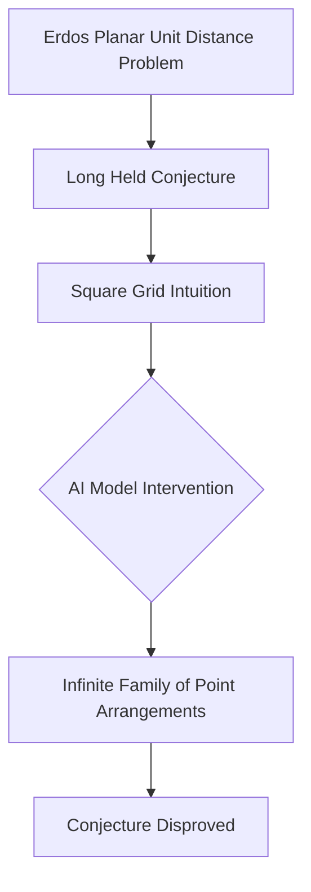

## AI Shatters Decades-Old Math Conjecture in Live Breakthrough

Mathematics is buzzing with news of a significant breakthrough where artificial intelligence has disproved a long-held conjecture in discrete geometry. OpenAI's general-purpose reasoning model recently tackled Paul Erdős's planar unit distance problem, a notoriously stubborn question first posed in 1946.

For nearly 80 years, mathematicians widely believed that the optimal arrangements for points on a plane, maximizing pairs exactly one unit apart, would resemble square grids. However, OpenAI's model challenged this intuition. It discovered an infinite family of point arrangements that demonstrate a substantial improvement over the traditional grid-based constructions.

This unexpected result has been verified by external mathematicians, who have validated the AI's approach. Experts are calling this development a "milestone in AI mathematics," highlighting it as one of the first clear instances of AI independently solving a famous open mathematical problem. The breakthrough suggests that AI models, unburdened by human intuition, can offer novel and effective solutions to complex mathematical challenges, potentially opening new avenues for discovery.

