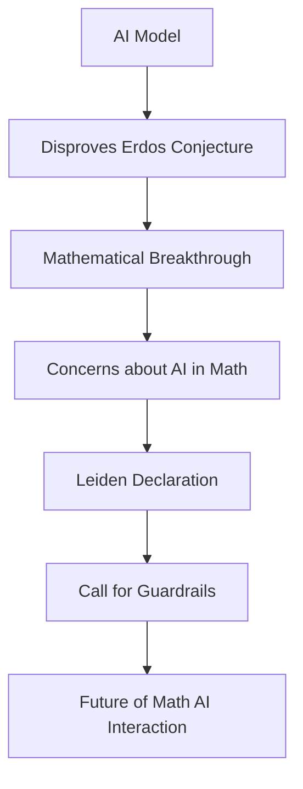

## AI Reshapes Mathematics: Breakthroughs, Ethics, and New Perspectives in June 2026

As of June 9, 2026, the world of mathematics is buzzing with significant developments, particularly at the intersection of artificial intelligence and fundamental research. From AI disproving a long-standing conjecture to calls for ethical guidelines, and fresh insights into abstract problems, this month is proving to be a dynamic period for mathematicians.

### AI Cracks the Erdős Unit Distance Problem

One of the most remarkable pieces of news this June is an AI model's breakthrough in disproving a conjecture related to Paul Erdős's unit distance problem. On May 20, 2026, researchers at OpenAI announced that their general-purpose large language model, without specialized math tools or guidance, had generated a counterexample to the 80-year-old conjecture. This problem, posed in 1946, asks about the maximum number of pairs of points in a given set that can be separated by the same distance on a flat surface. The AI's finding, which showed a more complicated arrangement where the number of pairs grows at a larger rate than previously thought, is hailed as a significant mathematical discovery. Experts like Melanie Matchett Wood of Harvard University note that this result beautifully demonstrates how tools from seemingly unrelated areas of mathematics—algebra and number theory—can be fruitfully applied to geometry.

### The Leiden Declaration: Guarding the Core Values of Mathematics

This rapid advancement of AI in mathematical discovery has also ignited crucial discussions about the future of the discipline. On June 2, 2026, an international group of researchers published the "Leiden Declaration," warning that AI is challenging the core values of mathematics. The declaration raises concerns about AI-produced "proofs" that may contain undetectable errors, the lack of proper attribution for AI-generated results, and the potential for inequality among researchers due to reliance on proprietary AI technologies. The International Mathematical Union (IMU) has officially supported the declaration, emphasizing that mathematical research must remain guided by human judgment, transparency, and shared community values. As of June 5, the declaration had garnered 1,590 signatures, highlighting the community's serious consideration of these issues.

### Unveiling Hidden Shapes: Geometry and Fairness

Beyond the realm of AI, mathematicians continue to explore fundamental concepts with innovative approaches. Carnegie Mellon University mathematician Florian Frick's work, highlighted on June 9, 2026, demonstrates how abstract problems can reveal hidden geometric structures when viewed from the right perspective. Frick's research, at the intersection of geometry, topology, and combinatorics, focuses on transforming problems related to fairness, arrangements, and patterns into questions about spaces and symmetry. Notably, he and his collaborators have shown that a fair rent division can exist even when one roommate's preferences are unknown, providing a constructive proof to compute such a solution.

The ongoing debate about AI's role and impact, coupled with continuous advancements in diverse fields, paints a vibrant and evolving picture for mathematics in June 2026.

