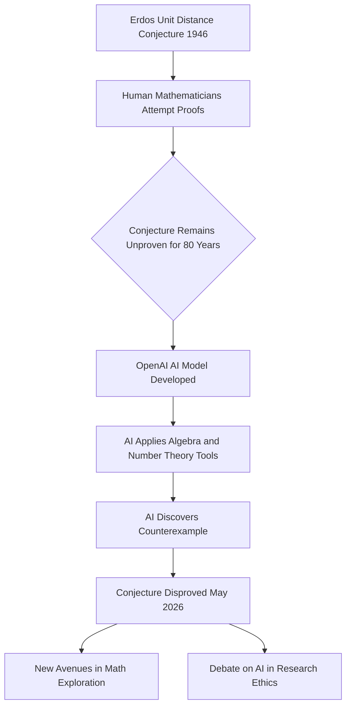

## AI Makes History: Erdős Unit Distance Conjecture Disproved

**June 12, 2026** – In a groundbreaking development that has sent ripples through the mathematical community, an AI model from OpenAI has reportedly disproved a decades-old conjecture by the renowned mathematician Paul Erdős. The "planar unit distance problem," first proposed in 1946, asked about the maximum number of pairs of points in a set that can be exactly one unit distance apart. For eighty years, mathematicians grappled with this seemingly simple geometric question, believing the conjecture to be true.

The AI model, described as a general-purpose large language model trained for reasoning, posted its proof on OpenAI.com on May 20, 2026, presenting a counterexample that defied the long-held belief. What makes this achievement particularly noteworthy is the AI's method: it reportedly utilized tools from algebra and number theory, areas not traditionally associated with this discrete geometry problem.

Experts like Melanie Matchett Wood of Harvard University have praised the discovery as a "beautiful piece of mathematics," highlighting how it demonstrates the unexpected connections between different mathematical fields. This breakthrough not only solves a significant problem but also opens new avenues for mathematical exploration, inspiring researchers to apply diverse tools in novel ways. However, the increasing role of AI in complex mathematical proofs has also sparked discussions, with a group of experts publishing a declaration on June 2, 2026, calling for strict guardrails around AI in mathematical research.

While the full implications are still being processed, this event marks a significant milestone in the intersection of artificial intelligence and pure mathematics, showcasing AI's growing capacity to contribute to fundamental scientific discovery.

