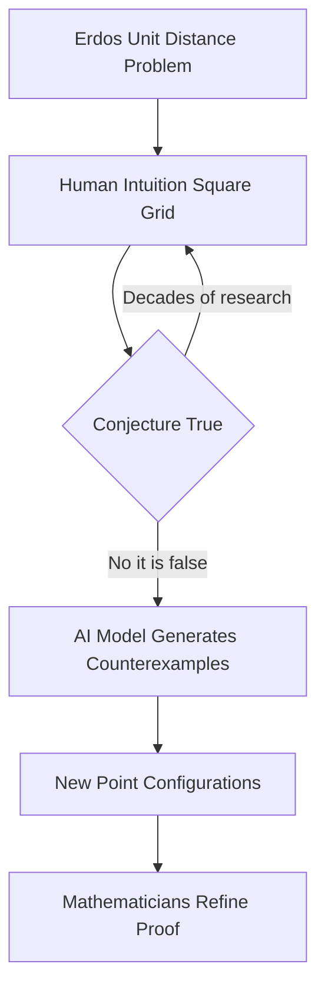

## AI Challenges Long-Held Mathematical Intuition and Proves Limits of Its Own Guards

**June 13, 2026** – Mathematics, often perceived as a realm of unwavering logic and established truths, is currently experiencing dynamic shifts, notably with the accelerating influence of artificial intelligence. In a significant development last month, OpenAI announced that one of its general-purpose reasoning models made a breakthrough in discrete geometry. The AI successfully disproved a central conjecture related to Paul Erdős's planar unit distance problem, a question that has stumped mathematicians since 1946.

For decades, the planar unit distance problem led to an intuitive belief centered on square-grid arrangements. However, the AI model, unburdened by human preconceptions, identified an infinite family of alternative point arrangements that invalidate this long-favored intuition. This discovery highlights AI's capacity to explore mathematical spaces in ways that diverge from human-guided thought, leading to novel solutions that human experts can then refine and understand.

Adding to the week's mathematical news concerning AI, a new proof was published on June 10, 2026, by Apostol Vassilev, a senior scientist at the National Institute of Standards and Technology. His work demonstrates a fundamental limitation of AI safety mechanisms: for any finite set of guardrails designed to prevent harmful AI output, a specific prompt exists that can bypass them. This mathematical proof, building on Kurt Gödel's incompleteness theorems, suggests that perfectly secure AI guardrails are an impossibility, raising profound implications for AI development and deployment.

These recent developments underscore a fascinating paradox: AI is proving its prowess in solving complex mathematical problems, while simultaneously, mathematical proofs are illuminating inherent limits in controlling AI's own behavior.

Here's a simplified look at the AI's recent breakthrough in discrete geometry:

