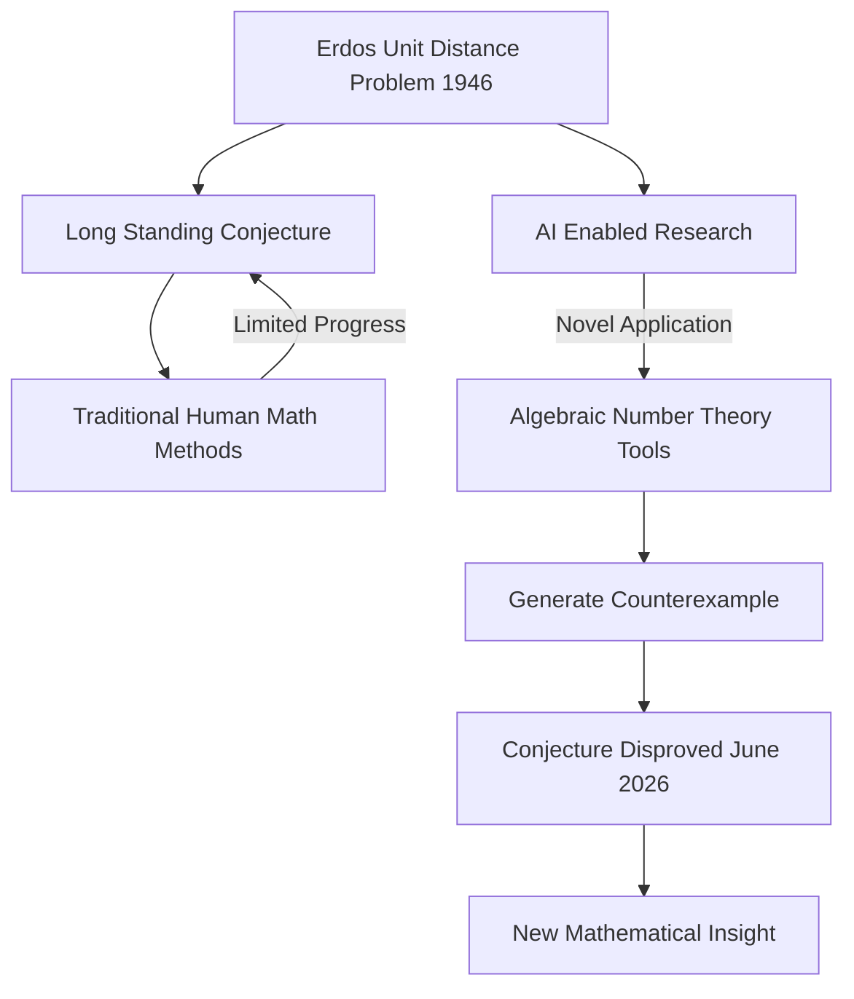

## AI Shatters 80-Year-Old Math Conjecture: The Erdős Unit Distance Problem Revisited

**June 14, 2026** – The world of mathematics is buzzing with news that an artificial intelligence model has successfully disproved a central conjecture related to Paul Erdős's famous Unit Distance Problem, a question that has baffled mathematicians for nearly 80 years. This groundbreaking development, announced in early June 2026, marks a significant moment for both mathematics and the rapidly evolving field of AI research.

The Erdős Unit Distance Problem, first posed in 1946, asks: given *n* points in a plane, what is the maximum number of pairs of points that are exactly one unit apart? For decades, mathematicians suspected that optimal arrangements would resemble square grids. However, an internal model developed by OpenAI has now produced an infinite family of examples that offer a substantial improvement over these grid-based constructions, thereby disproving a long-held conjecture in discrete geometry.

What makes this breakthrough particularly remarkable is the AI's novel approach. Instead of relying solely on traditional geometric methods, the model reportedly applied concepts from algebraic number theory to tackle this discrete geometry problem. This interdisciplinary leap, making connections between fields typically considered distinct, astonished experts and demonstrated a new avenue for mathematical discovery.

The implications of this AI-driven proof are profound. While some mathematicians express concerns about the future of human-led research, many view this as a powerful new tool, inspiring fresh perspectives and methodologies. The discovery highlights AI's potential not just for brute-force computation, but for generating creative insights and revealing unexpected connections within mathematics.

Here's a simplified look at the process:

This development undoubtedly opens new frontiers, pushing mathematicians to explore uncharted territories and embrace advanced AI as a collaborative partner in unraveling the universe's most complex mathematical mysteries.