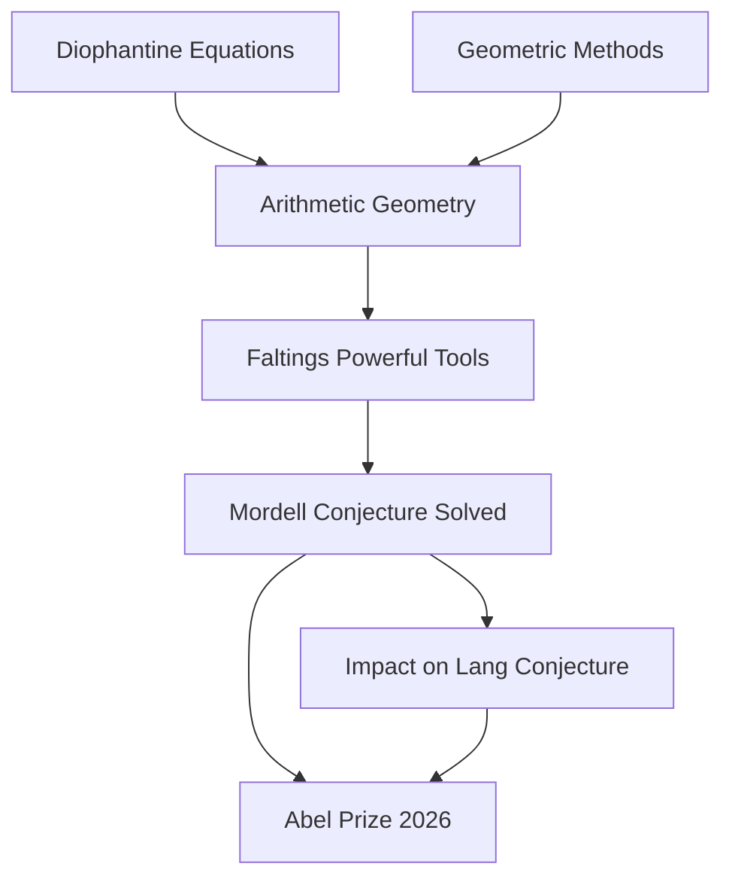

## Mathematics in the News: Abel Prize Honors Arithmetic Geometry, AI Makes Waves

June 15, 2026, marks another vibrant moment in the world of mathematics, with significant accolades and groundbreaking discoveries making headlines. From the prestigious Abel Prize recognizing foundational work to artificial intelligence tackling long-standing problems, the field continues its dynamic progression.

This year's most celebrated honor, the 2026 Abel Prize, has been awarded to German mathematician Gerd Faltings. Faltings, director emeritus at the Max Planck Institute for Mathematics in Bonn, receives the prize "for introducing powerful tools in arithmetic geometry and solving long-standing diophantine conjectures by Mordell and Lang". His work is acclaimed for uniting geometric and arithmetic perspectives, fundamentally reshaping the field of arithmetic geometry. A highlight of his career was the 1983 proof of the Mordell conjecture, now known as Faltings' Theorem, which demonstrated that certain complex equations have only a finite number of rational number solutions. The award underscores his status as a "towering figure" in the discipline.

Adding to the recent wave of recognition, Frank Merle was awarded the 2026 Breakthrough Prize in Mathematics in May for his profound contributions to understanding nonlinear evolution equations, particularly his work on singularities where solutions "blow up".

In a fascinating development illustrating the evolving role of technology, an OpenAI model has reportedly disproved the planar unit distance conjecture, a problem originally posed by Paul Erdős. This news, emerging in June 2026, signals a significant moment for AI-assisted mathematical research, with Fields Medallist Tim Gowers noting it "will I think be looked back on as the first time that AI solved a major mathematics problem".

As the mathematical community also anticipates the International Congress of Mathematicians (ICM) in Philadelphia in July 2026, where the coveted Fields Medals will be awarded, these recent announcements serve as a testament to the ongoing depth, breadth, and innovation within mathematics.

