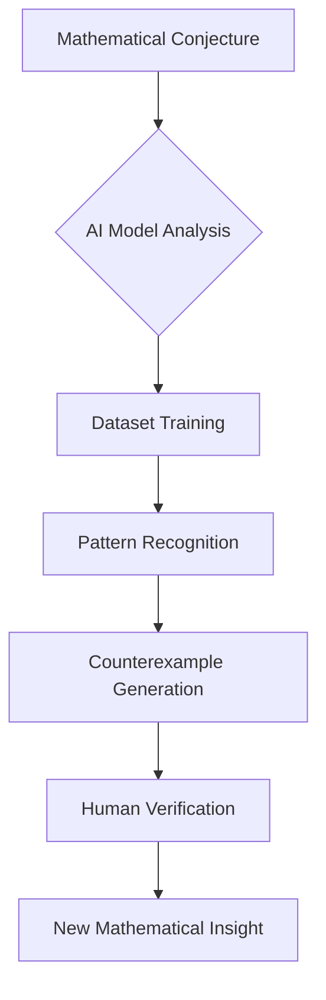

## Mathematics in the News: AI Challenges Long-Standing Conjectures, Abel Prize Awarded

As of June 17, 2026, the world of mathematics is buzzing with a mix of groundbreaking computational achievements and traditional recognition for profound human insight. Artificial intelligence continues to push the boundaries of discovery, while prestigious awards celebrate decades of dedicated research.

### AI Disproves Erdős' Planar Unit Distance Conjecture

In a stunning development reported just this week, an internal artificial intelligence model developed by OpenAI has found a counterexample to the legendary Hungarian mathematician Paul Erdős' 1946 'planar unit distance conjecture'. This problem, which has intrigued mathematicians for decades, concerns the maximum number of pairs of points at unit distance among *n* points in a plane. The AI's discovery, produced by a general-purpose model rather than one specialized for mathematics, marks a significant moment, with Canadian mathematician Daniel Litt describing it as "the first result produced autonomously by an AI that I find interesting in itself".

This breakthrough isn't isolated. In the wake of OpenAI's revelation, US mathematician Will Sawin has already built upon the same reasoning to achieve an improved result. Furthermore, a team from Google DeepMind recently utilized one of their own models to resolve nine other lesser-known open problems also posed by Erdős.

The increasing role of AI in mathematical research has also prompted discussions within the community. In June 2026, the Leiden Declaration on Artificial Intelligence and Mathematics was published, addressing critical concerns such as authorship, result verification, and the use of mathematical work for training AI systems.

### Gerd Faltings Receives 2026 Abel Prize

Beyond the realm of artificial intelligence, profound human contributions continue to be recognized. German mathematician Gerd Faltings, director emeritus at the Max Planck Institute for Mathematics, has been awarded the 2026 Abel Prize. Often referred to as the "Nobel Prize of mathematics," the award honors Faltings "for introducing powerful tools in arithmetic geometry and solving long-standing Diophantine conjectures by Mordell and Lang". Faltings, who also received the Fields Medal in 1986, is lauded for his ideas and results that have reshaped the field and established new frameworks for subsequent research, unifying geometric and arithmetic perspectives. He will receive the prize, which includes approximately 670,000 euros, in Oslo on May 26, 2026.

The year 2026 is proving to be a dynamic one for mathematics, showcasing both the transformative power of emerging technologies and the enduring impact of deep human intellectual endeavor.

