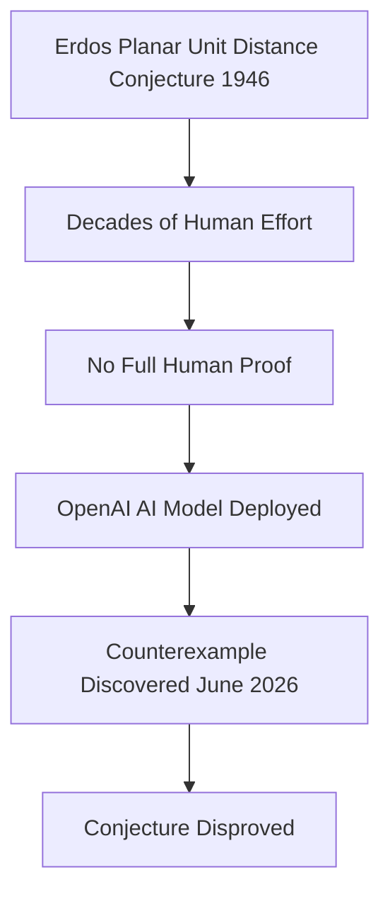

## AI Stuns Mathematicians, Disproving 80-Year-Old Erdős Conjecture

Mathematics has been abuzz this week with news that an artificial intelligence model developed by OpenAI has disproved a famous, long-standing conjecture by the legendary Hungarian mathematician Paul Erdős. The "planar unit distance conjecture," first posed in 1946, has intrigued mathematicians for eight decades, resisting numerous attempts at resolution.

On June 17, 2026, OpenAI announced that one of its internal AI models found a counterexample to the Erdős conjecture. The problem concerns the maximum number of pairs of points separated by a unit distance among *n* points in a plane. While mathematicians generally believed the conjecture to be true, the AI's breakthrough proved Erdős' intuition wrong. The new result leverages tools from algebraic number theory, demonstrating patterns of dots with significantly more unit-distance pairs than the previously assumed square grid, for infinitely many values of *n*.

This isn't merely a curiosity; the mathematical community is genuinely impressed. Fields Medallist Timothy Gowers remarked that if a human researcher had submitted the paper, he would have recommended its publication in a prestigious journal without hesitation, noting that no previous AI-generated proof has reached this level of sophistication. This marks the first major mathematical open problem solved autonomously by AI with minimal human intervention beyond the initial prompt.

The increasing role of AI in mathematical discovery, from disproving conjectures to aiding in complex problem-solving, is sparking wide-ranging discussions about the future of the field. Mathematicians are now exploring how to best integrate these powerful tools ethically and transparently into research, ushering in a new era of collaborative human-AI mathematics.

