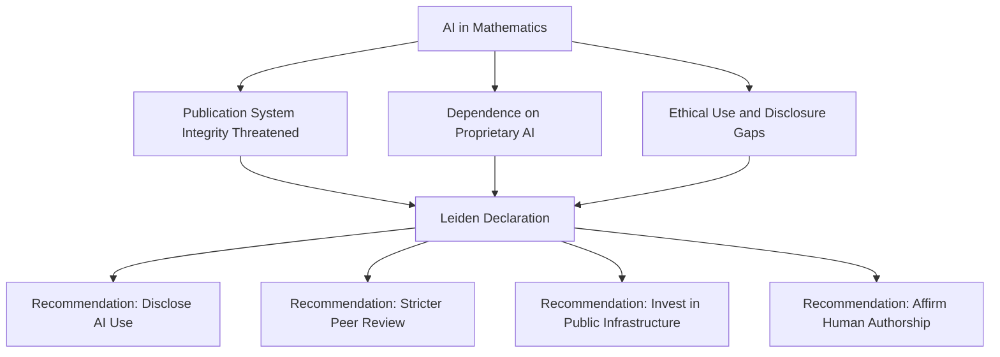

## Mathematics in the Age of AI: A Call for Transparency and Human Insight

**June 19, 2026** – The world of mathematics is buzzing not just with new theorems and solutions to long-standing conjectures, but with an urgent conversation about the role of artificial intelligence. As AI continues its rapid integration into scientific research, mathematicians are proactively addressing its impact on the foundational principles of their discipline.

This month, a significant development emerged with the publication of the **Leiden Declaration on Artificial Intelligence and Mathematics** on June 2nd, 2026. This declaration, spearheaded by an international group of researchers and endorsed by the International Mathematical Union, highlights critical challenges posed by widespread AI use in mathematics research. It underscores the need to protect the core values of mathematics, which include rigorous proof, human insight, and the cultivation of ideas, understanding, and judgment.

The declaration identifies several key concerns, such as the potential for publication systems to be overburdened with unreliable results generated or assisted by AI, the risk of researchers becoming dependent on proprietary AI technology and expensive computational resources, and the ethical implications surrounding the use and disclosure of AI tools.

In response, the Leiden Declaration outlines recommendations for individual researchers, organizations, governments, and commercial enterprises. These include advocating for the careful disclosure of AI use in research, implementing stricter peer-review processes, and investing in public computational infrastructure to foster a more equitable research landscape. Most importantly, it stresses that mathematics must remain a profoundly human endeavor, with an emphasis on affirming human authorship and taking responsibility for one's work.

This timely declaration comes amidst a period of remarkable human achievement in mathematics. For instance, the 2026 Breakthrough Prize in Mathematics was awarded to Frank Merle for his groundbreaking work on nonlinear evolution equations. Additionally, the New Horizons in Mathematics Prize recognized Hong Wang for her significant contributions to harmonic analysis, including the resolution of the Kakeya conjecture in three dimensions, alongside Otis Chodosh, Vesselin Dimitrov, and Yunqing Tang for their work in number theory. In a fascinating turn, mathematicians recently disproved a 150-year-old geometry rule, demonstrating that two distinct donut-shaped surfaces can appear identical when measured locally but differ globally.

These developments showcase the continued power of human intellect to push the boundaries of mathematical understanding. The Leiden Declaration serves as a crucial step to ensure that as AI becomes an increasingly powerful tool, it enhances rather than erodes the integrity and human spirit of mathematics.

