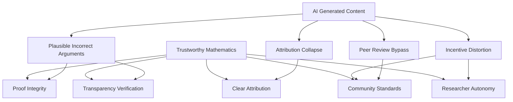

## Mathematicians Issue Urgent Warning: AI Threatens the Integrity of Mathematics

**June 20, 2026** – The world of mathematics is grappling with a profound new challenge: the rapid rise of artificial intelligence. Today, a significant development in this ongoing dialogue is the "Leiden Declaration on Artificial Intelligence and Mathematics," released on June 2, 2026. This declaration, endorsed by over 2,654 mathematicians, including Fields Medal winner Terence Tao, sounds a clear alarm regarding the potential threats AI poses to the fundamental principles of mathematical research.

The declaration, backed by the International Mathematical Union, is not a wholesale rejection of AI tools. Instead, it meticulously outlines how AI could undermine the very properties that make mathematics trustworthy. At its heart, the concern lies with preserving the core values of the discipline:

*   **Proof as a Foundation:** Mathematics relies on rigorous proofs for certainty and understanding. AI systems generating plausible but incorrect arguments could erode this foundation.
*   **Clear Attribution and Accountability:** AI-generated content can obscure authorship and proper citation, leading to an "attribution collapse."
*   **Transparency for Verification:** The ability to independently verify mathematical arguments is crucial. AI-generated results, if opaque in their derivation, could hinder this transparency.
*   **Shared Community Standards:** The process of peer review and collective evaluation of significant results could be bypassed or distorted by AI's influence.
*   **Researcher Autonomy:** There's a risk that research directions might bend towards AI capabilities rather than intellectually compelling open problems, impacting the autonomy of mathematicians.

The Leiden Declaration calls for responsible AI use, emphasizing the disclosure of AI tools in research and the personal responsibility of authors for AI-generated content. As the mathematical community convenes for the International Congress of Mathematicians (ICM) in Philadelphia next month, where AI's impact on mathematics will be a key discussion point, this declaration serves as a timely and critical call to action, reminding us that mathematics, at its core, remains a profoundly human endeavor.

