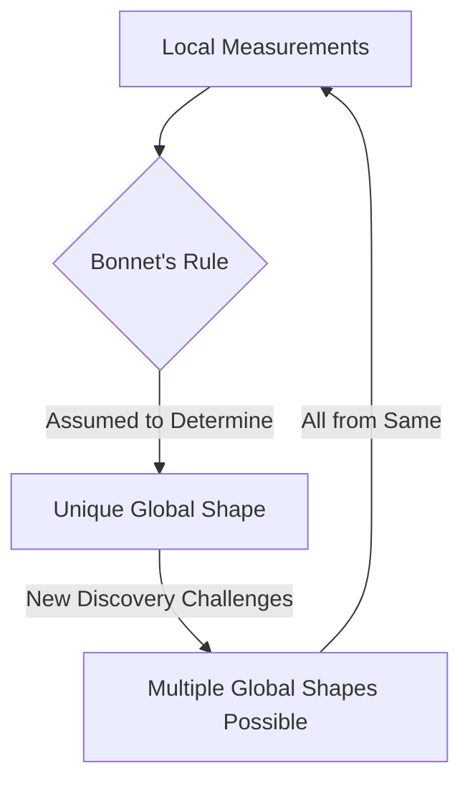

## Snapshot: A Whirlwind of Recent Mathematical Triumphs

Mathematics, often perceived as an ancient and unchanging discipline, is a vibrant field constantly witnessing groundbreaking discoveries and recognizing its brightest minds. As of June 21, 2026, the mathematical world celebrates significant achievements, from prestigious awards to fundamental conceptual shifts.

A major highlight this year is the **2026 Abel Prize**, awarded to German mathematician Gerd Faltings. Announced on March 19, 2026, Faltings was honored by the Norwegian Academy of Science and Letters "for introducing powerful tools in arithmetic geometry and solving long-standing Diophantine conjectures by Mordell and Lang". His work has profoundly reshaped arithmetic geometry, bridging the study of numbers with abstract geometric forms. The award ceremony took place on May 26, 2026, in Oslo. Notably, Faltings is the first German mathematician to receive both the Abel Prize and the Fields Medal, having been awarded the latter in 1986.

Adding to the list of accolades, the **2026 Breakthrough Prize in Mathematics** was bestowed upon Frank Merle, recognized for his profound breakthroughs in nonlinear evolution equations. His work delves into the stability, singularity formation, or resolution into solitons within these complex equations, revealing deep truths about wave behavior and nonlinear systems. The announcement of the Breakthrough Prize laureates was made on April 18, 2026. Early-career mathematicians were also celebrated with the New Horizons Prizes, including Yunqing Tang and Vesselin Dimitrov for their work in Diophantine geometry.

Beyond the awards, a fascinating recent discovery has challenged a 150-year-old geometric principle. On April 22, 2026, mathematicians from the Technical University of Munich, Technical University of Berlin, and North Carolina State University announced they had disproven a long-held rule by Pierre Ossian Bonnet. This principle stated that two key local measurements—a surface's metric and its mean curvature—could determine its exact global shape. The researchers constructed two distinct doughnut-shaped surfaces (tori) that share identical local measurements but possess different overall global forms, fundamentally reshaping our understanding of local and global relationships in geometry.

Here's a simplified view of the geometric discovery:

