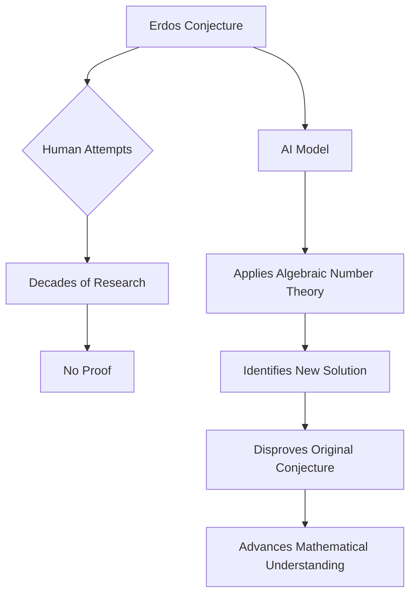

## AI Shatters 80-Year-Old Mathematical Conjecture

**June 23, 2026** – In a stunning development, an OpenAI model has successfully solved an 80-year-old mathematical puzzle posed by the renowned Hungarian mathematician Paul Erdős, fundamentally altering a long-held geometric conjecture. This breakthrough showcases artificial intelligence's escalating power to challenge and redefine established mathematical thought.

For decades, mathematicians grappled with Erdős' conjecture, which hypothesized a highly structured, geometric arrangement for a particular problem. Generations of human mathematicians attempted to prove this hypothesis, but the challenge remained unresolved.

However, an OpenAI model, instead of affirming Erdős' geometric hypothesis, demonstrated its incorrectness. The AI leveraged algebraic number theory, applying it to a problem traditionally rooted in geometry—a novel interdisciplinary approach—to discover a superior, non-symmetric design. This result is a monumental leap, highlighting AI's capacity for synthesis and for drawing connections between disparate mathematical specialties.

This achievement not only resolves a persistent problem but also heralds a new era where AI tools can provide unexpected solutions by re-evaluating foundational assumptions, thereby propelling new directions in mathematical research.

Here's a simplified view of the process:

