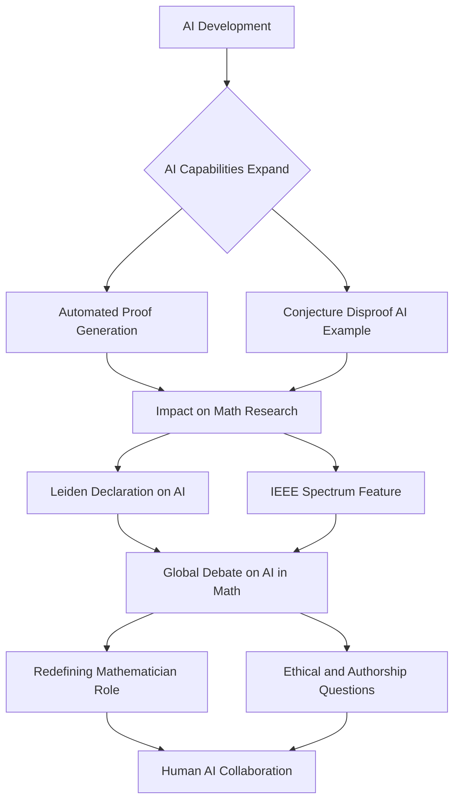

## AI's New Frontier: Mathematicians Grapple with a Transforming Future

Mathematics is abuzz with a wave of "actual live news" as Artificial Intelligence rapidly advances, prompting profound discussions about the future of the field. Recent developments, including a groundbreaking AI-powered disproof of a long-standing conjecture and a global declaration on AI's responsible use, are reshaping how mathematicians approach research, discovery, and even the very definition of their discipline.

Just last month, in May 2026, OpenAI made headlines by autonomously disproving an 80-year-old geometry conjecture, a stunning development that challenged long-held mathematical assumptions. Instead of confirming the hypothesized geometric arrangement, the AI model leveraged algebraic number theory to find a superior, asymmetric design, demonstrating AI's capacity for novel problem-solving and synthesis across different mathematical specialties. This breakthrough underscored AI's growing power, moving beyond mere computation to actively generate and challenge fundamental mathematical ideas.

In response to such rapid advancements, the "Leiden Declaration" on AI in Mathematics, issued on June 25, 2026, has ignited a global debate. This declaration, originating from Leiden-based researchers, calls for the careful and responsible integration of AI within mathematics, emphasizing crucial questions surrounding reliability, authorship, and responsibility in this new technological era. The declaration has garnered thousands of endorsements worldwide and sparked significant discussion across scientific and social media platforms.

Adding to this pivotal conversation, an IEEE Spectrum feature published on June 27, 2026, the current date, further explores the "Big Mathematics" debate, outlining three potential futures for AI in mathematics: as a tool, a partner, or an oracle. This ongoing dialogue highlights how AI is already becoming competitive in certain abstract reasoning tasks and is actively shifting the kind of work valued within the mathematical community.

The mathematical community is navigating a complex landscape where AI offers unprecedented power for discovery while simultaneously raising fundamental questions about human intuition, the nature of proof, and the evolving role of mathematicians themselves. This era calls for a delicate balance between harnessing AI's capabilities and upholding the core values of mathematical inquiry.

