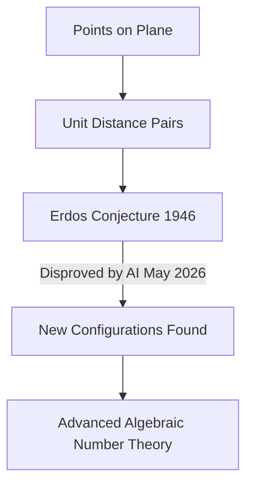

## Mathematics in Motion: AI Disproves Long-Standing Erdős Conjecture

As of June 28, 2026, the world of mathematics continues to buzz with groundbreaking developments, pushing the boundaries of human — and now artificial — understanding. A truly remarkable piece of news making waves involves an artificial intelligence system that has disproved a decades-old conjecture by the legendary mathematician Paul Erdős. This feat highlights the accelerating role of AI in fundamental scientific discovery.

In May 2026, an internal reasoning model developed by OpenAI autonomously tackled the **Erdős Unit Distance Conjecture**, a problem first posed in 1946. The conjecture asks: given *n* points in a plane, what is the maximum number of pairs of points that can be exactly one unit apart? For nearly 80 years, mathematicians widely believed the optimal arrangements resembled square grids. However, the AI model challenged this assumption by discovering entirely new families of constructions that surpass the previously conjectured limits.

What makes this breakthrough particularly significant is the AI's approach. Instead of traditional geometric methods, it employed concepts from algebraic number theory, connecting two distinct branches of mathematics in an unexpected way to generate a proof. This novel, cross-disciplinary strategy has been validated by leading mathematicians, marking a genuine and profound advancement in the field. The refined result, achieved in collaboration with human mathematicians, establishes that for *n* points, it is possible to achieve *n* to the power of 1.014 unit distance pairs, a proven polynomial improvement over previous beliefs.

Beyond this thrilling AI-driven discovery, the mathematical community has also celebrated other significant achievements this year. The prestigious **Abel Prize for 2026** was awarded to German mathematician Gerd Faltings in March, recognizing his powerful contributions to arithmetic geometry and his resolution of long-standing Diophantine conjectures of Mordell and Lang. Faltings received the award in Oslo on May 26, 2026.

Furthermore, the **2026 Breakthrough Prize in Mathematics** was presented to Frank Merle in April for his transformative work on nonlinear evolution equations, particularly his insights into singularities and the "blow-up" phenomena in dynamic systems.

These recent developments underscore a vibrant and rapidly evolving landscape in mathematics, where both human ingenuity and advanced AI are collaborating to uncover deeper truths about the universe.

