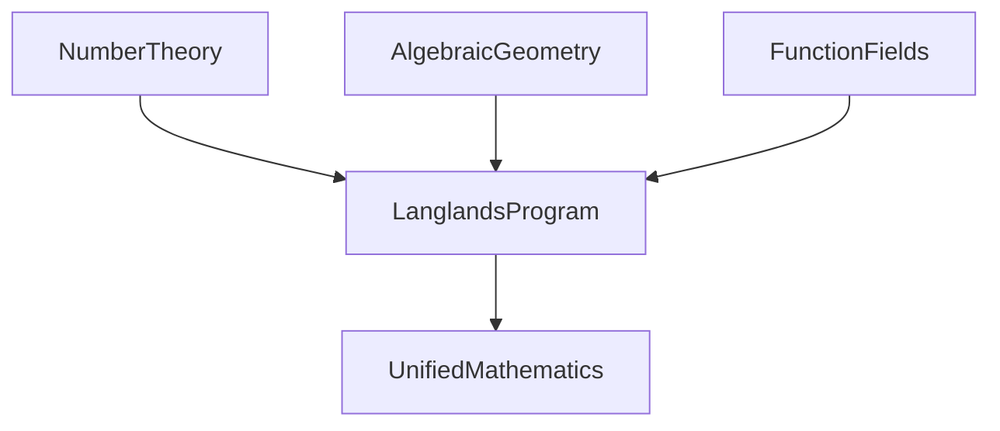

## Mathematics in Motion: A Unified Vision and Solved Mysteries

Even as the world whirls through 2026, the realm of pure mathematics continues to unveil profound discoveries, reshaping our understanding of fundamental structures. While daily headlines rarely feature mathematical proofs, the past year has been remarkably vibrant with breakthroughs that promise to influence the field for decades to come.

One of the most monumental achievements reported in early 2025 was the full proof of the **Geometric Langlands Conjecture**. This complex theory, a cornerstone of the broader Langlands program, has been hailed as a potential "grand unified theory of mathematics". A collaborative effort by nine researchers, culminating in nearly 1,000 pages of published work, the proof for the first time establishes the conjecture over characteristic zero fields. It creates deep and surprising connections between seemingly disparate areas of mathematics: number theory, geometry, and function fields, often likened to a "Rosetta Stone" for translating insights between these domains.

The Langlands program aims to link these diverse mathematical landscapes:

Beyond this unifying theory, 2025 also saw the resolution of other long-standing problems. The **three-dimensional Kakeya Conjecture** was settled, confirming that any set in three-dimensional space containing a unit line segment in every direction must have full dimension. This deceptively simple problem had stumped mathematicians for decades, opening new avenues in analysis and geometric measure theory.

Furthermore, a major case of **Hilbert's ambitious Sixth Problem** was solved in March 2025. This achievement places the laws of fluid dynamics on firmer mathematical footing by demonstrating how Newton's microscopic equations converge to Boltzmann's mesoscopic equation, addressing a challenge posed over a century ago.

These recent advancements underscore a period of dynamic progress and renewed excitement within the mathematical community, promising new tools and inspirations for future generations.