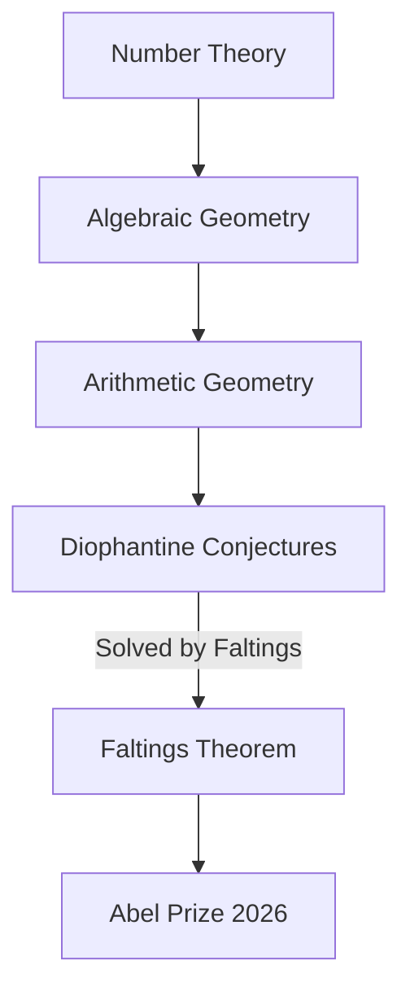

## Mathematics in Motion: A Mid-2026 Snapshot of Discovery and Recognition

As we step into July 2026, the world of mathematics continues to buzz with groundbreaking discoveries, prestigious accolades, and significant international events. From fundamental theoretical advances to the increasing integration of artificial intelligence, the discipline is vibrant and ever-evolving.

One of the most significant announcements this year came in March when German mathematician Gerd Faltings was awarded the 2026 Abel Prize. Often regarded as mathematics' equivalent of the Nobel Prize, the Abel Prize honors Faltings for his profound contributions to arithmetic geometry, a field that elegantly blends number theory and algebraic geometry. He received the award for "introducing powerful tools in arithmetic geometry and solving long-standing Diophantine conjectures by Mordell and Lang." Notably, Faltings also received the Fields Medal in 1986, placing him among a rare group of mathematicians to have won both esteemed prizes.

The excitement in the mathematical community is also building towards the highly anticipated International Congress of Mathematicians (ICM) 2026, scheduled to take place from July 23–30 in Philadelphia. A major highlight of the ICM will be the presentation of the Fields Medals, awarded every four years to exceptional mathematicians under the age of 40. While the recipients are kept secret until the ceremony, speculation is rife, with figures like Hong Wang being discussed as strong contenders for their impactful work, including advances related to the Kakeya conjecture. The United States is also celebrating 2026 as the "Year of Mathematics," coinciding with its role as host for the ICM.

Beyond awards, foundational research continues to push boundaries. In a surprising development in April 2026, mathematicians challenged a 150-year-old geometrical principle. Researchers from the Technical University of Munich, the Technical University of Berlin, and North Carolina State University demonstrated that two distinct doughnut-shaped surfaces, known as tori, can appear identical when measured locally but possess different overall global structures. This breakthrough reshapes our understanding of the relationship between local measurements and global form in geometry.

The influence of artificial intelligence in mathematics is also growing rapidly. Google DeepMind's "Gemini Deep Think" mode (codenamed Aletheia), as of January 2026, has demonstrated remarkable progress in solving complex Olympiad-level math problems and has even contributed to advancements in research-level mathematics. These AI tools are showing the capacity to apply advanced concepts from seemingly unrelated branches of continuous mathematics to discrete algorithmic challenges.

The ongoing interplay between deep theoretical insight, technological innovation, and global collaboration ensures that mathematics remains a dynamic and vital field.

