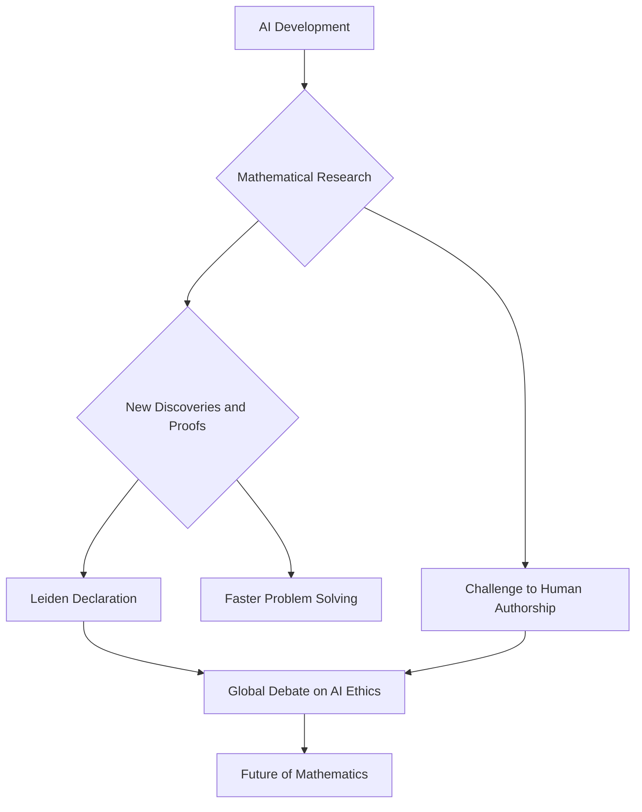

## Mathematics in the Age of AI: A New Frontier Unfolds

July 02, 2026 — The world of mathematics is buzzing with activity this summer, grappling with both profound theoretical breakthroughs and the rapidly evolving impact of artificial intelligence. Recent events highlight a pivotal moment for the discipline, as mathematicians seek to define the role of AI in discovery and uphold core values of research.

One of the most significant recent developments is the "Leiden Declaration on Artificial Intelligence and Mathematics," released in early June 2026. This declaration has sparked a global conversation about the careful and responsible integration of AI within mathematics, emphasizing reliability, authorship, and ethical considerations in an era of unprecedented technological change. The declaration quickly resonated internationally, garnering attention in major scientific and general media outlets.

The urgency of this discussion is underscored by recent advancements in AI itself. In May and June 2026, AI models demonstrated remarkable capabilities. OpenAI's o1-series autonomously produced a complete proof for the 80-year-old Erdős unit distance problem in discrete geometry, making an unexpected connection to algebraic number theory that humans had not previously identified. Furthermore, a lemma generated by GPT-5.5, known as Lemma 3.4, played a crucial role in a paper by Bloom, Sawin, Schildkraut, and Zhelezov, which disproved the Erdős–Szemerédi sum-product conjecture over real numbers, a problem unsolved for over four decades. These instances raise important questions about how to formally credit and cite non-human contributions in academic research, as current systems lack mechanisms for AI authorship.

These breakthroughs signal a new era for mathematical research, where AI is not merely a tool but an emerging collaborator. The ongoing dialogue initiated by the Leiden Declaration will be crucial in shaping the future trajectory of mathematical discovery in partnership with artificial intelligence.

