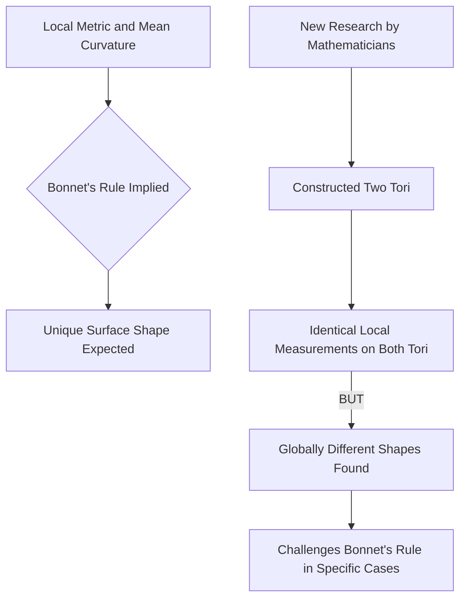

## Geometry Gets a Sweet Shake-Up: 150-Year-Old Rule Overturned!

**July 05, 2026** – Mathematics is rarely static, and recent breakthroughs continue to prove it. In a significant development that has geometers buzzing, a long-standing principle dating back 150 years has been challenged and proven incorrect in specific instances. This exciting news reshapes our understanding of how local measurements relate to the overall form of surfaces.

For over a century and a half, mathematicians relied on a principle, originating with French mathematician Pierre Ossian Bonnet, that suggested if you know two key properties of a compact surface—its metric (distances along the surface) and its mean curvature (how it bends in space)—at every point, you could determine its exact global shape. It was a foundational idea in geometry.

However, in April 2026, a team of mathematicians from the Technical University of Munich (TUM), the Technical University of Berlin, and North Carolina State University published groundbreaking research that upends this assumption. They constructed two distinct compact, self-contained surfaces, both shaped like doughnuts (known as tori). Crucially, these two surfaces share identical values for both their metric and mean curvature, yet their overall structures are demonstrably not the same.

This discovery provides a concrete example that has eluded researchers for decades, demonstrating that local measurement data does not always guarantee a single global shape, even for closed, doughnut-like surfaces. The finding forces a re-evaluation of fundamental concepts in differential geometry and opens new avenues for exploring the intricate relationship between local properties and global forms.

In other live news, the mathematical community is gearing up for the **International Congress of Mathematicians (ICM) 2026**, scheduled for July 23-30 in Philadelphia, USA. This quadrennial event is a major highlight, where the prestigious Fields Medals, often considered the highest honor in mathematics, will be awarded. Speculation is rife regarding potential laureates, with names like Hong Wang, recognized for her work on the Kakeya conjecture, and Jacob Tsimerman, known for resolving the André-Oort conjecture, frequently mentioned as strong contenders. Additionally, the 2026 Abel Prize was awarded to Gerd Faltings.

The recent geometric breakthrough, alongside the anticipation surrounding the ICM and Fields Medals, highlights a vibrant and continuously evolving landscape in the world of mathematics.

Here’s a simplified look at the challenged geometric principle:

