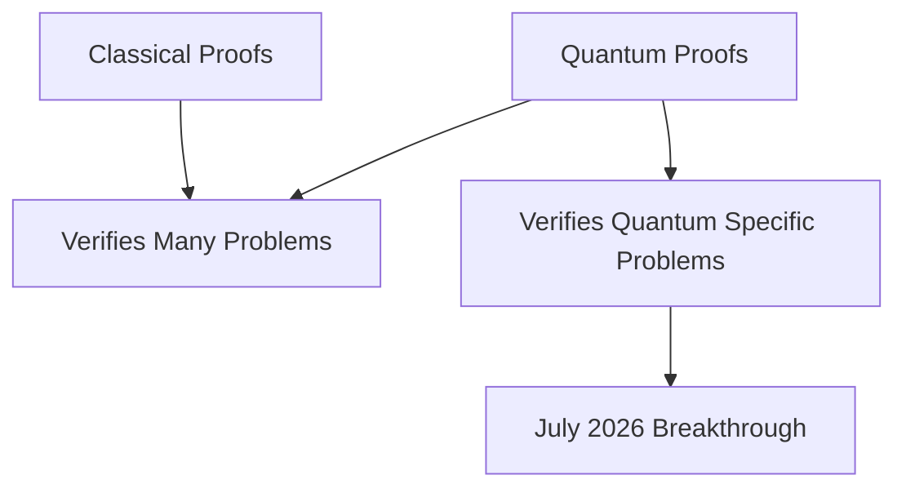

## Mathematics in Motion: Quantum Leaps and Geometric Revelations

The world of mathematics continues its vibrant expansion, with groundbreaking discoveries and crucial discussions shaping its future. As of July 6, 2026, the community is abuzz with a significant breakthrough in the realm of computational theory, alongside recent landmark resolutions and upcoming major events.

### The Power of Quantum Proofs Unveiled

In a pivotal development, researchers have definitively shown that "quantum proofs" are more powerful than their classical counterparts. A 100-page paper, which earned a best-paper award at the June 2026 Symposium on Theory of Computing, has identified a unique computational problem that demonstrably requires a quantum proof, something no classical proof can achieve. This resolution, achieved by four researchers, comes after over 30 years of investigation into the comparative power of quantum and classical computation, marking a crucial step in understanding the inherent complexities of the quantum world.

This advancement is not just theoretical; it explores deep philosophical questions about quantum theory and could pave the way for future applications in cryptography. Anand Natarajan, a quantum information theorist at MIT, lauded the result for its "beautiful" nature and the "fresh, new ideas" it introduces.

Here's a simplified view of the concept:

### Other Recent Milestones

Beyond this quantum leap, the mathematical landscape has seen other notable events:

*   **Geometric Rule Disproven**: In April 2026, mathematicians disproved a 150-year-old geometric principle known as Bonnet's Rule. They presented two distinct doughnut-shaped surfaces, or tori, that possess identical local measurements (metric and mean curvature) but differ in their overall global form, challenging a long-held assumption in geometry.
*   **2026 Breakthrough and Abel Prizes**: This spring saw major accolades bestowed. Frank Merle received the 2026 Breakthrough Prize in Mathematics for his profound work on nonlinear evolution equations. Separately, the 2026 Abel Prize was awarded to Gerd Faltings for his groundbreaking contributions to arithmetic geometry, particularly for resolving long-standing Diophantine conjectures. Hong Wang was also recognized with the 2026 New Horizons in Mathematics Prize and a Clay Research Award for her resolution of the three-dimensional Kakeya conjecture.
*   **The Leiden Declaration on AI and Mathematics**: Released on June 2, 2026, this declaration, drafted by 16 participants from a September 2025 conference, addresses the growing influence of Artificial Intelligence in theoretical mathematics. It advocates for preserving mathematics' core purpose of expanding human understanding amidst the rapid advancements in AI applications.
*   **International Congress of Mathematicians (ICM) 2026**: Later this month, from July 23-30, Philadelphia will host the most prestigious conference in the mathematical community. The ICM 2026 will feature hundreds of talks and presentations on cutting-edge developments, including public lectures by renowned mathematicians like Terence Tao and Manjul Bhargava.

These recent developments underscore the dynamic and ever-evolving nature of mathematics, from foundational theoretical proofs to its societal implications and major international gatherings.