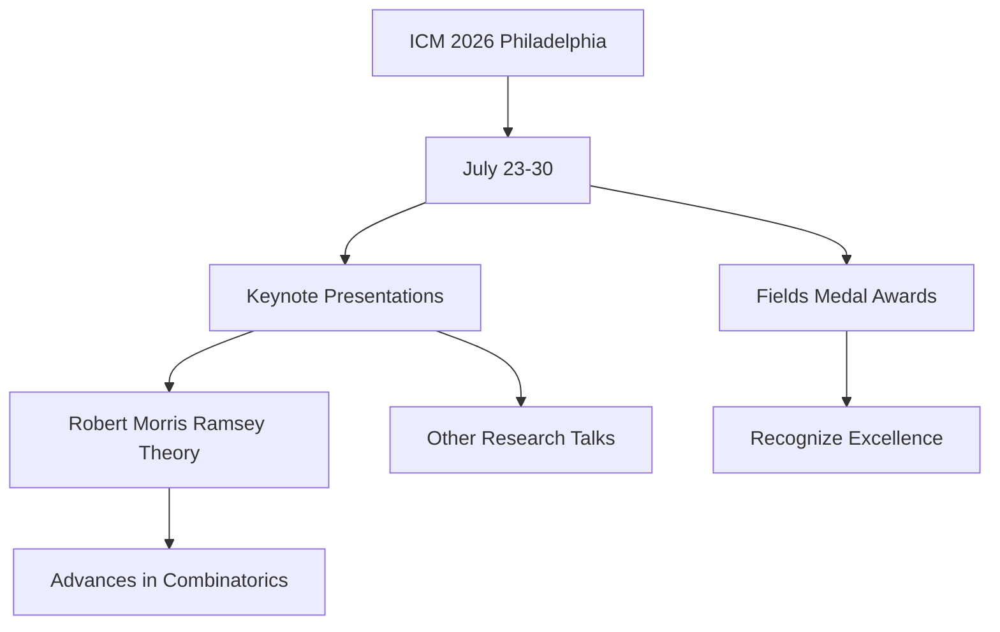

## Mathematics World Turns Focus to Philadelphia for ICM 2026

The global mathematical community is abuzz as the International Congress of Mathematicians (ICM) 2026 is set to convene in Philadelphia, USA, from July 23 to 30. Held every four years, the ICM is the most significant gathering for mathematicians worldwide, bringing together leading figures to share groundbreaking research and recognize outstanding achievements.

A major highlight of the congress will be the announcement of several prestigious scientific awards, including the highly anticipated Fields Medal. Often regarded as the equivalent of a Nobel Prize in mathematics, the Fields Medal honors exceptional mathematical achievement and promise in researchers under 40.

Beyond the accolades, the ICM serves as a platform for showcasing the cutting edge of mathematical inquiry. Among the notable presentations, IMPA researcher Robert Morris is scheduled to deliver a Plenary Lecture on "Recent Results in Ramsey Theory." This talk will feature significant advancements in combinatorics, including a 2023 breakthrough that dramatically improved the upper bound of Ramsey's Theorem—a development considered the most significant in the field since 1935. Other distinguished mathematicians, such as Jorge Vitório Pereira and Luna Lomonaco from IMPA, are also slated to present on diverse topics like holomorphic foliations and algebraic correspondences, respectively.

The ICM 2026 promises to be a pivotal event, shaping future research directions and celebrating the enduring power and beauty of mathematics.

