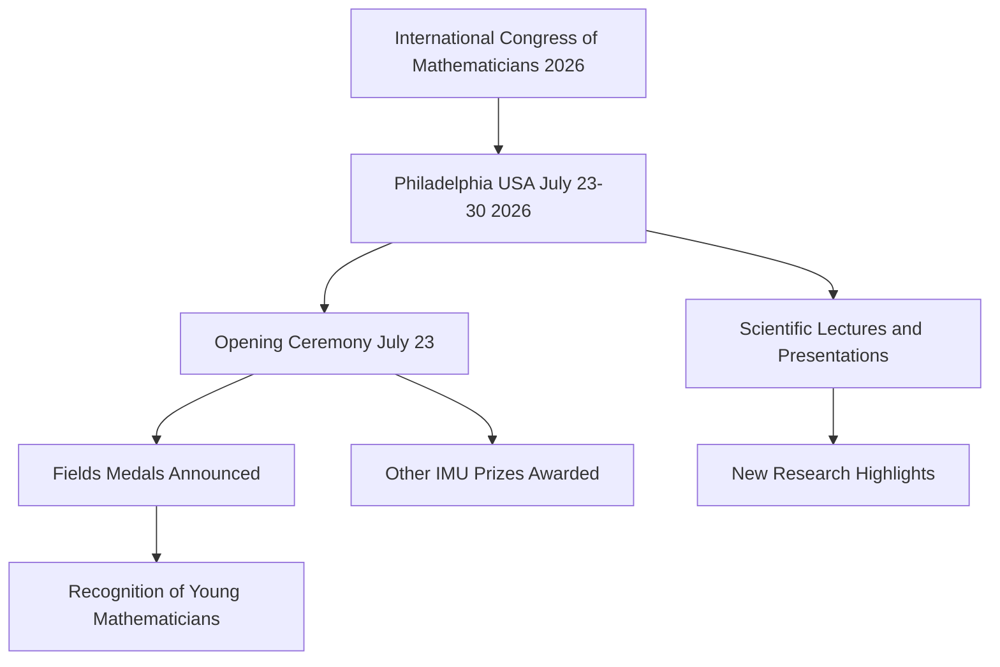

## Mathematics in Motion: Abel Prize Honors Faltings as Fields Medal Anticipation Builds

The world of mathematics is buzzing with activity this July, featuring a recent prestigious award and the imminent gathering of the global mathematical community for its most significant event.

Earlier this year, the esteemed **Abel Prize for 2026** was awarded to German mathematician **Gerd Faltings**. Announced on March 19, 2026, Faltings, director emeritus at the Max Planck Institute for Mathematics in Bonn, was recognized "for introducing powerful tools in arithmetic geometry and solving long-standing diophantine conjectures by Mordell and Lang." This accolade highlights his monumental work, which has profoundly reshaped the field by uniting geometric and arithmetic perspectives. Faltings had previously received the Fields Medal in 1986, making him one of the few mathematicians to have earned both top honors.

Meanwhile, anticipation is reaching a fever pitch for the **International Congress of Mathematicians (ICM) 2026**, set to take place in Philadelphia, USA, from July 23-30, 2026. This quadrennial event is the stage for the presentation of the highly coveted Fields Medals, often referred to as the "Nobel Prize of mathematics," alongside other significant awards like the Abacus Medal, Carl Friedrich Gauss Prize, Chern Medal, and Leelavati Prize. As of July 10, 2026, speculation is rife regarding who the Fields Medal recipients will be, with the official announcement scheduled for the opening ceremony on July 23.

Beyond these major awards, groundbreaking research continues to push the boundaries of mathematical understanding. Just recently, in April 2026, mathematicians announced a significant breakthrough that disproved a 150-year-old rule in geometry. Researchers demonstrated that two distinct donut-shaped surfaces, or tori, can appear identical when measured locally but possess fundamentally different global forms, challenging a principle known as Bonnet's rule. This discovery reshapes how mathematicians perceive the relationship between local measurements and overall geometric structure.

The upcoming ICM 2026 in Philadelphia promises to be a hub of mathematical innovation and recognition.

