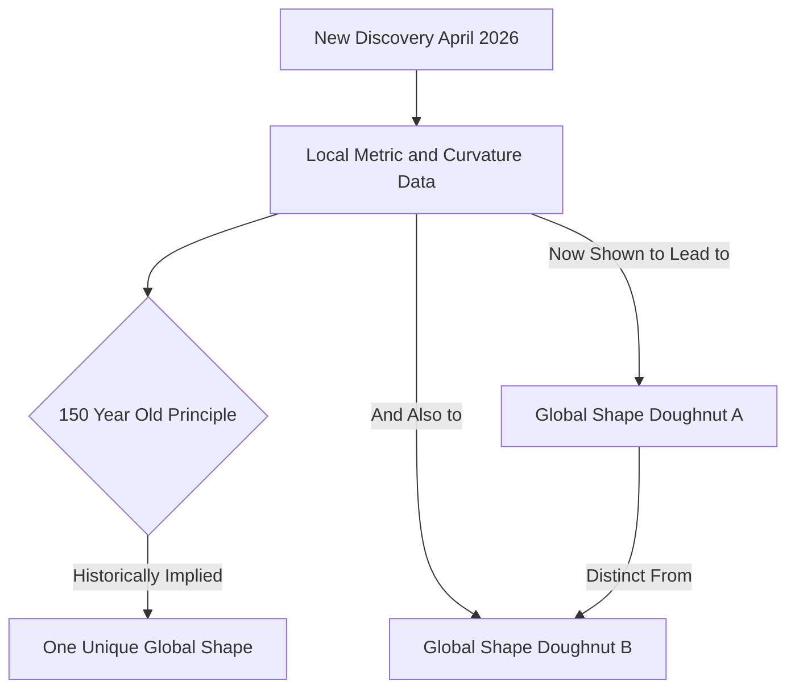

## A Geometric Shake-Up: Donut Shapes Disprove 150-Year-Old Principle

**July 11, 2026** – The world of mathematics is buzzing with a recent geometric breakthrough that has upended a principle held for over 150 years. In April 2026, mathematicians unveiled a discovery challenging Pierre Ossian Bonnet's long-standing assumption about how local measurements determine the global shape of a surface.

For generations, a foundational idea in geometry, originating with Bonnet, posited that if you knew two key properties of a compact surface—its metric (distances along the surface) and its mean curvature (how it bends in space)—at every point, you could uniquely determine its exact overall shape. This principle has guided how mathematicians conceptualized surfaces, particularly "doughnut-shaped" objects known as tori.

However, a team of researchers from the Technical University of Munich, the Technical University of Berlin, and North Carolina State University has now proven this assumption does not always hold true. They constructed two distinct compact, self-contained surfaces, both shaped like doughnuts, that share identical values for their metric and mean curvature, yet their global structures are demonstrably different. This concrete counterexample, sought by researchers for decades, reshapes our fundamental understanding of the relationship between local measurements and global form.

This revelation underscores that even deeply entrenched mathematical principles can be subject to revision, opening new avenues for research into the intricate nature of geometric spaces.

