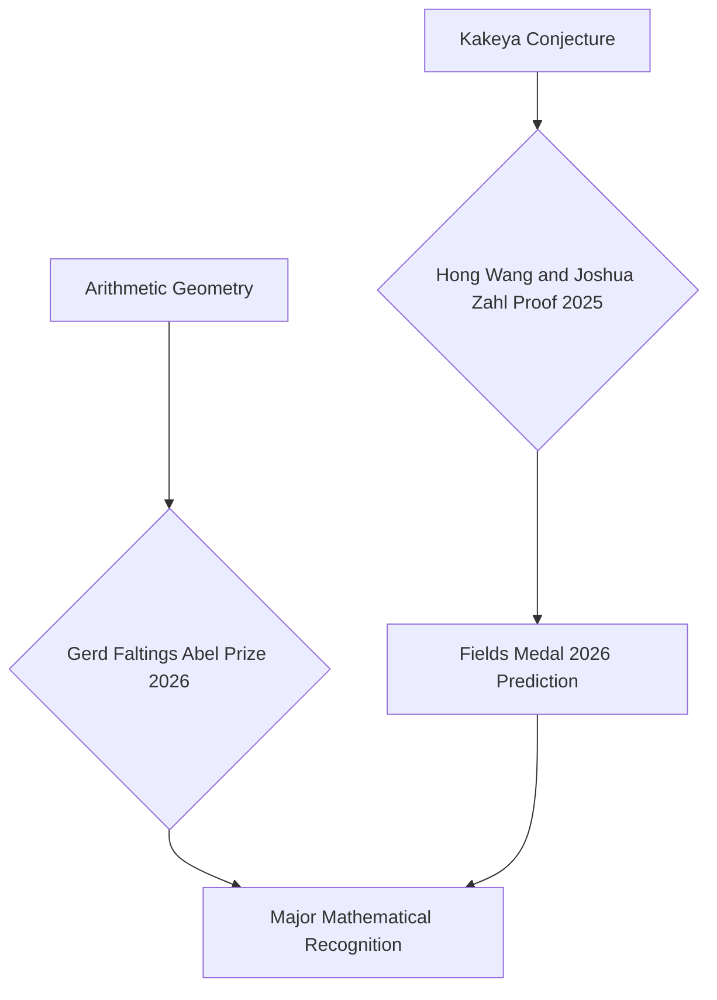

### Mathematics World Holds Breath for Fields Medal Announcements at ICM 2026

As of July 12, 2026, the mathematical community is buzzing with anticipation for the upcoming International Congress of Mathematicians (ICM) in Philadelphia, scheduled for July 23-30, 2026. This quadrennial event is the stage for some of the most prestigious accolades in mathematics, notably the Fields Medals, often considered the "Nobel Prize of mathematics" for researchers under 40.

Speculation is rife regarding who will be honored this year, with strong predictions emerging for groundbreaking work from the past few years. A leading candidate generating significant discussion is Hong Wang, whose work, in collaboration with Joshua Zahl, resolved the three-dimensional Kakeya conjecture in February 2025. This century-old problem, posed in 1917 by Sōichi Kakeya, asks about the minimum volume a set must have if it contains a unit line segment in every direction. Wang's 127-page proof, validated by luminaries like Terence Tao, has been hailed as a "once-in-a-century kind of result," making her an 89% implied probability to receive a Fields Medal. Other mathematicians frequently mentioned in pre-award discussions include Jacob Tsimerman, Yu Deng, Jack Thorne, and John Pardon.

Earlier this year, in March 2026, the mathematics world also celebrated the awarding of the Abel Prize to German mathematician Gerd Faltings. Faltings, an emeritus director at the Max Planck Institute for Mathematics, was recognized "for introducing powerful tools in arithmetic geometry and solving long-standing diophantine conjectures by Mordell and Lang." His pivotal 1983 proof of the Mordell conjecture, which showed that certain complex equations have only a finite number of rational solutions, stands as a cornerstone of his work.

These recent accolades and the impending announcements at the ICM underscore the vibrant and ever-evolving landscape of mathematical discovery.

