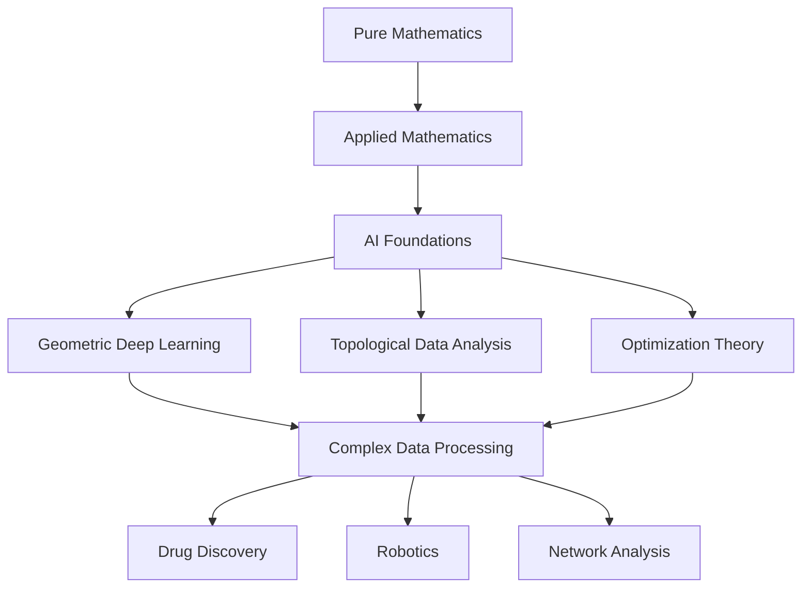

## Mathematics in Motion: A Mid-2026 Snapshot

As of July 17, 2026, the world of mathematics is buzzing with activity, from groundbreaking theoretical solutions to applications that are reshaping artificial intelligence and engineering. This year, the United States is celebrating the Year of Mathematics, a national initiative culminating in the International Congress of Mathematicians (ICM) in Philadelphia later this month. The ICM is set to be a global mathematical moment, with the highly anticipated Fields Medals awarded.

One name currently in the spotlight is Jacob Tsimerman, a professor at the University of Toronto, who is a leading contender for the 2026 Fields Medal for his transformative work, including his contribution to solving the André-Oort conjecture.

This July has also seen significant recognition for contributions to the field. The Society for Industrial and Applied Mathematics (SIAM) recently announced its 2026 prize recipients, including the George Pólya Prize in Mathematics, awarded to Duncan Dauvergne, Janosch Ortmann, and Bálint Virág for their discovery of the directed landscape, and the W. T. and Idalia Reid Prize presented to Anthony Michael Bloch for his contributions to geometric mechanics and control theory.

Beyond accolades, fundamental problems are being solved and new mathematical tools are emerging:

*   **Feynman's Sprinkler Mystery Unraveled:** A team of mathematicians has finally solved the decades-old Feynman's Sprinkler Problem. Using innovative "silly sprinklers," they experimentally confirmed that the rotation of both normal and reverse sprinklers is solely driven by the momentum of flowing water. This breakthrough offers new insights into fluid dynamics and could influence the design of fluid-powered machines.
*   **Topology Enhances AI Optimization:** Researchers at the University of Tokyo have introduced a novel method blending topology with optimization techniques. This approach, which utilizes Hodge spectral relaxations, allows for finer control over data structure, promising improvements in areas like image recognition and network stability by directly incorporating topological constraints into algorithms.
*   **Solving "Unsolvable" Problems:** A new method developed by a Northeastern researcher is enabling computers to tackle previously "unsolvable" optimization problems using Quadratic Unconstrained Binary Optimization (QUBO). This technique is set to revolutionize various disciplines, from drug discovery to logistics, by efficiently finding optimal solutions in complex decision-making scenarios.

The mathematical foundations of Artificial Intelligence continue to be a fertile ground for research and development. Workshops dedicated to this area, such as the "Mathematical Foundations of AI 2026" that took place earlier this June, are addressing critical topics like the theoretical understanding of Transformers and Diffusion Models. Fields like Geometric Deep Learning (GDL) and Topological Deep Learning (TDL) are particularly active, extending traditional deep learning to handle complex, non-Euclidean data structures. These advancements are crucial for applications ranging from molecular property prediction in drug discovery to advanced robotics and network analysis, as they enable AI to understand inherent symmetries and structures within data.

