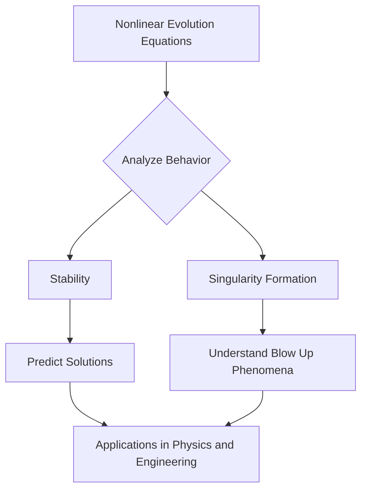

## Mathematics in Motion: Celebrating Groundbreaking Discoveries of 2026

Mathematics continues to push the boundaries of human understanding, and 2026 has already been a remarkable year for groundbreaking achievements and prestigious accolades. From profound theoretical advancements to insights into complex systems, the mathematical community has seen significant milestones.

One of the most esteemed honors, the Abel Prize, was awarded to German mathematician Gerd Faltings on March 19, 2026. Faltings, director emeritus at the Max Planck Institute for Mathematics, received the prize for his "introducing powerful tools in arithmetic geometry and solving long-standing diophantine conjectures by Mordell and Lang." His work has fundamentally reshaped arithmetic geometry by uniting geometric and arithmetic perspectives.

Adding to the excitement, the 2026 Breakthrough Prize in Mathematics was announced on April 18, 2026, recognizing Frank Merle from CY Cergy Paris Université and Institut des Hautes Études Scientifiques. Merle was honored for his "breakthroughs in nonlinear evolution equations, with regards to their stability, singularity formation, or resolution into solitons." His research has significantly advanced the understanding of how dynamic systems, like waves and fluids, change over time, even revealing that some equations thought to be stable can "blow up" or become infinite in finite time.

The Breakthrough Prize Foundation also celebrated early-career mathematicians with the New Horizons in Mathematics Prize. Recipients included Hong Wang for her work in harmonic analysis and geometric measure theory, notably for advances on the Kakeya conjecture, and Vesselin Dimitrov and Yunqing Tang for solving long-standing problems in number theory. The Maryam Mirzakhani New Frontiers Prize, recognizing women mathematicians recently completing PhDs, was awarded to Amanda Hirschi for her contributions to symplectic topology and Anna Skorobogatova for geometric measure theory.

These recent awards highlight the diverse and vibrant landscape of contemporary mathematical research, demonstrating how profound theoretical insights continue to expand our knowledge of the universe's fundamental structures.

