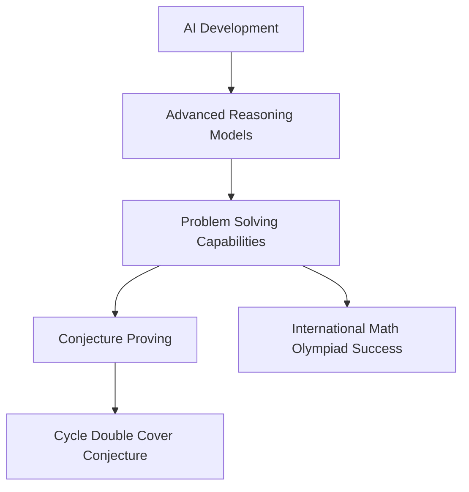

## Mathematics in Motion: A Mid-2026 Snapshot

As of July 19, 2026, the world of mathematics is buzzing with groundbreaking discoveries, significant recognitions, and major events. From challenging long-held geometric assumptions to witnessing artificial intelligence prove complex conjectures, the field continues to demonstrate its dynamic and ever-evolving nature.

This year, the prestigious **Abel Prize** was awarded to German mathematician Gerd Faltings. He was recognized for his introduction of powerful tools in arithmetic geometry and his resolution of long-standing Diophantine conjectures of Mordell and Lang, work that has profoundly impacted number theory.

In a fascinating development that redefines our understanding of shape and form, mathematicians have challenged a 150-year-old geometric rule. Researchers discovered two distinct doughnut-shaped surfaces, known as tori, which appear identical when measured locally but possess different global structures. This breakthrough reshapes how mathematicians perceive the relationship between local measurements and overall form, overturning Pierre Ossian Bonnet's principle.

Perhaps one of the most astonishing stories emerging from 2026 is the rapid advancement of Artificial Intelligence in tackling complex mathematical problems. Remarkably, GPT-5.6 Sol Ultra produced a proof for the **Cycle Double Cover Conjecture**, a problem that had remained unresolved for five decades. Furthermore, GPT-5.6 Pro showcased its incredible reasoning by solving all six problems from the 2026 International Mathematical Olympiad on its first attempt, a feat typically achieved by only a handful of human contestants worldwide. These achievements highlight AI's growing prowess and its potential to revolutionize mathematical research.

The mathematical community is also gearing up for a monumental event: the **International Congress of Mathematicians (ICM 2026)**, set to take place in Philadelphia from July 23-30. This congress is the culmination of the United States' "Year of Mathematics 2026," a nationwide initiative to engage the public with the beauty and relevance of mathematical sciences. The ICM will be a platform for sharing cutting-edge research and recognizing outstanding achievements, including the highly anticipated awarding of the Fields Medal, considered one of the highest honors in mathematics. Jacob Tsimerman, a professor at the University of Toronto, is a leading contender for the 2026 Fields Medal for his work on the André-Oort conjecture.

The collective energy from these discoveries and events underscores a vibrant period for mathematics, pushing the boundaries of knowledge and inspiring future generations.

