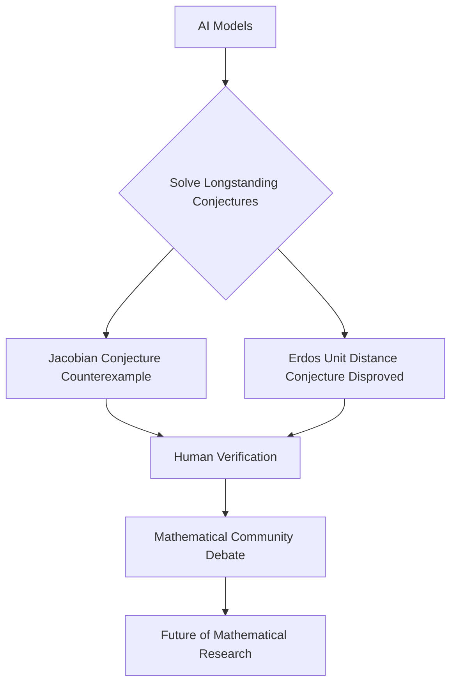

The world of mathematics is abuzz as artificial intelligence continues its remarkable ascent, particularly with groundbreaking developments surfacing in mid-2026. The most recent headlines showcase AI's increasing ability to tackle and resolve complex, long-standing conjectures that have stumped human mathematicians for decades.

In a stunning development this July, an Anthropic researcher, Levent Alpöge, utilizing the Fable 5 AI model, successfully discovered a counterexample to the 87-year-old Jacobian Conjecture. This monumental achievement was swiftly and independently verified by mathematicians globally within hours of its announcement. This follows another significant breakthrough in May 2026, when OpenAI's general reasoning model autonomously disproved the Unit Distance Conjecture, a problem originally proposed by the legendary Paul Erdős in 1946.

These recent successes are not isolated incidents but rather a continuation of AI's accelerating impact on mathematical research. While these advancements are celebrated for their problem-solving prowess, they have also ignited a crucial discussion within the mathematical community. The Leiden AI and Mathematics Manifesto, released in June 2026 and endorsed by the International Mathematical Union, highlights concerns about AI's potential to disrupt the traditional peer-review system, create challenges in attribution, and influence the future direction of mathematical research. Mathematicians are now grappling with how to integrate AI tools responsibly while preserving the core values and human-driven exploration of their field.

The advent of AI in mathematics signals a transformative era, promising new avenues for discovery but also necessitating a thoughtful re-evaluation of human and machine collaboration in the pursuit of mathematical truth.

