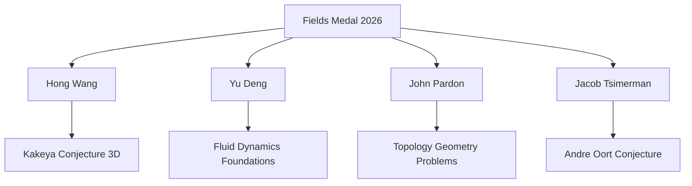

## Fields Medals Awarded, AI Makes Waves in a Dynamic Year for Mathematics

**Philadelphia, PA – July 24, 2026** – The world of mathematics is buzzing with activity, culminating in the recent announcement of the prestigious 2026 Fields Medals yesterday. This quadrennial award, often regarded as the Nobel Prize of mathematics, recognized four exceptional young researchers for their groundbreaking contributions, alongside other significant advancements including a notable AI breakthrough.

The International Mathematical Union awarded the 2026 Fields Medals to:

*   **Hong Wang (New York University):** Recognized for her pivotal work in harmonic analysis and geometric measure theory, most notably for resolving the three-dimensional Kakeya conjecture. Wang is only the third woman in the award's 90-year history to receive a Fields Medal.
*   **Yu Deng (University of Chicago):** Honored for his deep insights into connecting microscopic and macroscopic descriptions of gases, which has helped place the laws of fluid dynamics on a firmer mathematical foundation.
*   **John Pardon (Stony Brook University):** Awarded for his solutions to major problems in the fields of topology and geometry.
*   **Jacob Tsimerman (University of Toronto):** Celebrated for developing powerful new techniques in algebraic geometry that have advanced progress on long-standing mathematical puzzles, including his proof of the André-Oort conjecture.

Beyond these celebrated achievements, 2026 has already seen other remarkable developments. In May, an OpenAI model sensationally disproved the 80-year-old unit distance conjecture in discrete geometry, marking a significant milestone for AI-driven mathematics. Additionally, in April, mathematicians challenged a 150-year-old rule in geometry by demonstrating two distinct donut-shaped surfaces that are locally identical but globally different, reshaping understandings of form and measurement.

The diverse nature of these breakthroughs underscores a vibrant and rapidly evolving mathematical landscape, where human ingenuity continues to push boundaries, now increasingly complemented by the power of artificial intelligence.

